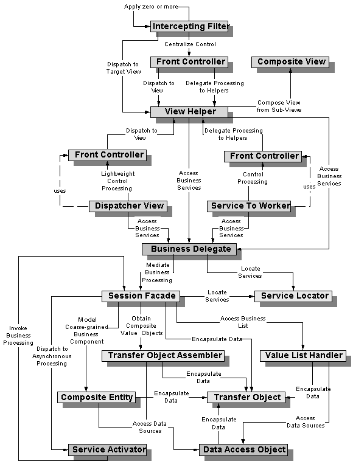

# Sun에서 제공하는 J2EE Pattern Catalog

  
# Core J2EE Patterns에서 제공하는 Catalog.  

  
**1. Presentation Tier Patterns**  
  Interceping Filter  
  Front Controller  
  Context Object  
  Application Controller  
  View Helper  
  Composite View  
  Service to Worker  
  Dispatcher View  
  
**2.**  **Business Tier Patterns**  
  Business Delegate  
  Service Locator  
  Session Facade  
  Application Service  
  Business Object  
  Composite Entity  
  Transfer Object  
  Transfer Object Assembler  
  
**3. Integration Tier Patterns**  
  Data Access Object  
  Service Activator  
  Web Service Broker
