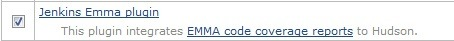
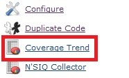
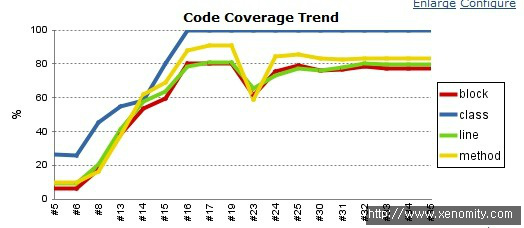
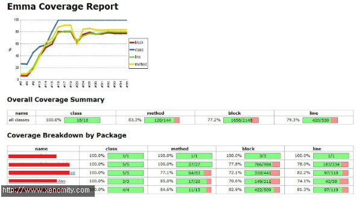

Emma는 TestCase를 품질지표로 설정하기 위한 Test Coverage Reporting Tool로써, PMD Code Inspection과 함께 대표적으로 많이 쓰이는 품질관리 도구이다.

## 1. Maven POM
```xml
<build>
    <plugins>
        ...
        <plugin>
            <groupId>org.apache.maven.plugins</groupId>
            <artifactId>maven-surefire-plugin</artifactId>
            <inherited>true</inherited>
            <configuration>
                <forkMode>always</forkMode>
                <reportFormat>xml</reportFormat>
            </configuration>
        </plugin>
        <!-- EMMA -->
        <plugin>
            <groupId>org.codehaus.mojo</groupId>
            <artifactId>emma-maven-plugin</artifactId>
            <version>1.0-alpha-1</version>
            <configuration>
                <filters>
                    <filter>-*.Test*</filter>
                </filters>
            </configuration>
        </plugin>
    </plugins>
</build>
 
...
 
<!-- Reporting -->
<reporting>
    <plugins>
        ...
        <plugin>
            <groupId>org.codehaus.mojo</groupId>
            <artifactId>emma-maven-plugin</artifactId>
            <inherited>true</inherited>
        </plugin>
    </plugins>
</reporting>
```
  
참고로 Emma Maven Plug-in을 적용하기 위해서는 반드시 maven-surefire-plugin의 reportFormat을 xml로 설정해줘야 한다.  
위를 보면, `<build>`는 build시의 test coverage 분석 및 xml 결과를 생성하기 위한 Emma 설정이며, `<reporting>` 부분은 결과셋을 토대로 HTML을 생성하기 위한 설정에 해당한다.  
  
  

## 2. Hudson CI 통합
Hudson 2.1 기준에서 Emma 결과를 보기 위해서는 먼저 Jenkins Emma Plug-in이 설치되어 있어야 한다.  


  
정상적으로 빌드가 완료되면 좌측메뉴에 'Coverage Trend'라는 메뉴가 생성되며, Code Coverage Trend 그래프를 볼 수 있다.  






  

  
* Build, Test가 실패하거나 TestCase가 하나도 없는 경우, Emma Report는 정상적으로 나타나지 않는다.
