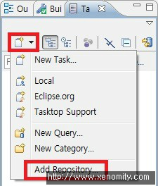
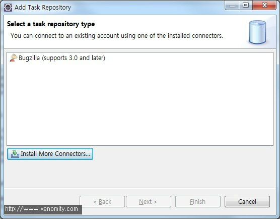
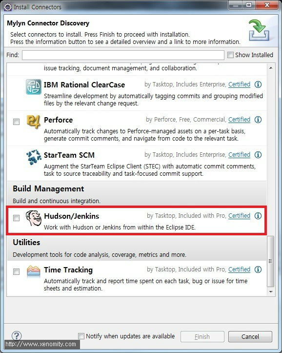
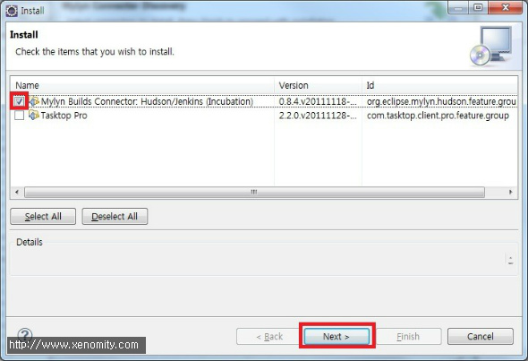
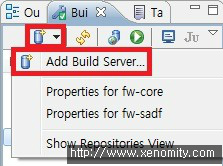
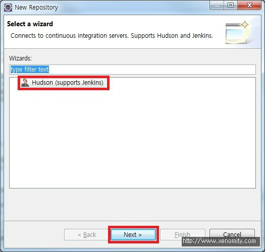
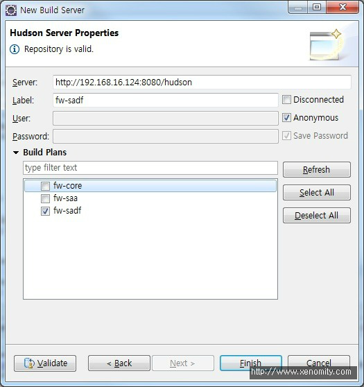
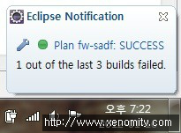
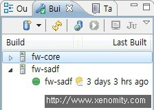
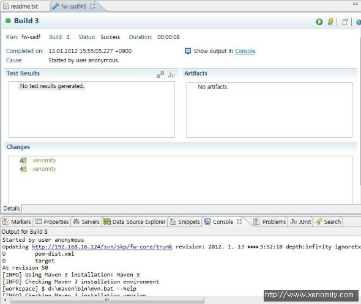

Mylyn은 Trac/Jira와 같은 Issue Tracker나 SCM, CI, 기타 build 도구들과의 통합 및 모니터링을 지원하여 좀 더 빠른 작업 및 모니터링, 문서화가 가능하게 한다. 또한 Outlook, Gmail 등의 연동으로 일정, 작업리스트, 메일 등의 통합관리도 지원하는 개인적으로 좋아하는 플러그인 중의 하나이다.. ^\_^;  
  
이번에는 대표적인 CI 도구인 Hudson을 Mylyn과 통합하는 방법을 포스팅해 본다. Mylyn에서는 Hudson connector를 통한 Build History, 각 빌드별 Output Console, Job Execution, JUnit 테스트 결과 등의 통합환경을 제공한다.  
  
- 작업환경 : Eclipse 3.7 Indigo, Hudson 2.2.0

## 1. Install Hudson connector for Mylyn
Task List View -> New Task -> Add Repository  

  
Click Install More Connectors...  

  
Build Management -\> Hudson/Jenkins   

  
Select Mylyn Builds Connector: Hudson/Jenkins (Incubation)  

  
  

## 2. Build Server 등록
Mylyn Build View -> New Build Server Location -> Add Build Server  

  
Select Hudson  


```
Server : Hudson URL  
Label : Mylyn에서 보여질 Task명  
User/Password : 익명(Anonymous) 로그인이 아니라면, Hudson 계정 입력  
```

이 과정을 거치고 Validate 버튼을 클릭하면, Hudson에 등록된 Job 목록이 Build Plans 리스트에 보여진다.  
Mylyn과 연동을 원하는 Job을 선택한다.  


  
정상적으로 연동되면, Eclipse Notofication 및 Job 목록을 확인할 수 있다.  

  

  

