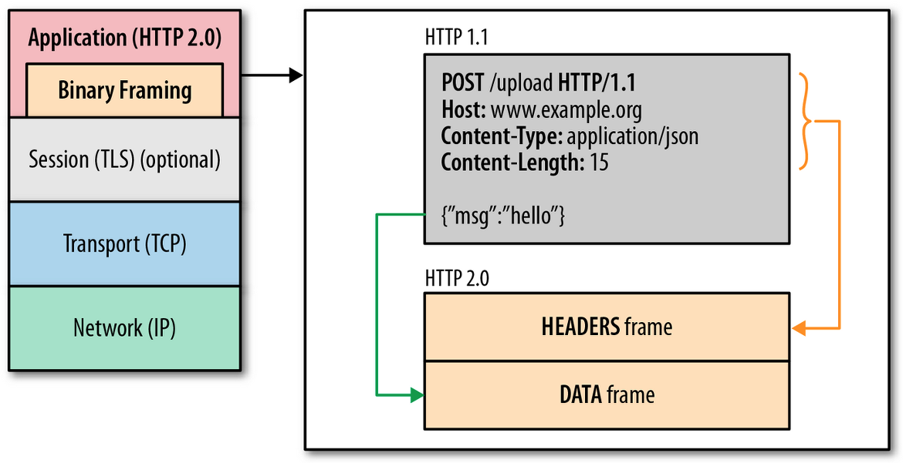

# Summary of HTTP/2

## Problem
`HTTP/1.x`의 -*단일 요청과 응답*-은 불필요한 RTT 증가와 네트워크 지연을 초래한다. 기본적으로 HTTP는 단일 연결에서 단일 요청만을 처리할 수 있으므로 모든 메세지 교환은 순차적이며 latency는 증가할 수밖에 없다. 이는 몇 가지 사이트들의 성능 통계만 보아도 알 수 있는 부분이다. HTTP는 대표적으로 다음과 같은 문제점을 지닌다.

* 제한적인 병렬성.
* 단일 요청/응답에 의한 Client-side 요청 큐 대기.
* HTTP Header(+Cookie)의 비대화, HTTP Metadata의 크기로 인한 오버헤드 발생.

이런 문제들을 해소하기 위하여 다양한 방법들이 강구되었지만 대부분 원천적인 해결 방법이 되지는 못했으며, 오히려 비표준, 호환성의 문제라던가 구현상의 어려움 등 추가적인 문제를 수반하게 되었다.

* Latency 감소를 위한 여러 가지...  
	* Parallel Connections
	* KEEP-ALIVE (HTTP/1.0+)
	* Pipelining (HTTP/1.1)
	* Customized Header/Entity Compression
	* Inlining
	* Image Spriting
	* Domain Sharding
	* HTTP-NG, SPDY, etc.

그렇게 시간이 흐르고 2012년 후반부터 Google [SPDY](http://www.chromium.org/spdy)를 기반으로 `HTTP/2`의 제안 작업이 시작되었다.  
(*See [Hypertext Transfer Protocol version 2](http://http2.github.io/http2-spec/)*)  
대충 훑어보아도 multiplexed stream, server push 등 SPDY와 상당히 닮았다. 하지만 SPDY처럼 TLS 기반(*정확히 말하면 TLS 확장, '[NPN](https://tools.ietf.org/html/draft-agl-tls-nextprotoneg-04)'*)에서만 동작하는 것은 아니고 공개 표준 프로토콜이기에 여러모로 가능성을 넓힌다.

## HTTP/2 Features
태초의 HTTP가 TCP 프로토콜 기반의 메세지 교환 고수준화, 비연결성 등을 목표로 설계되었다면, `HTTP/2`는 -*Low Latency*-에 촛점을 맞춰 설계되었다. 하나의 연결로 다수의 메세지 교환을 가능하게 디자인 하는 것이 주요 핵심이다.  
다음은 `HTTP/2`의 대표적인 특징을 나열한 것이다.

* 기존 HTTP/1.1 의미 체계 유지.
* Binary Protocol.
* One TCP Connection.
* Multiplexed Streams.
* Header Compression.
* Stream Prioritization.
* Flow Control.
* TLS 확장 '[ALPN](https://tools.ietf.org/html/rfc7301)' 지원.

## HTTP/2 Design & Advantages

- 그림 1. HTTP/2 Layout (이미지 출처: Google)

### One TCP Connection
* 단일 연결을 통한 메세지 교환은 불필요한 네트워크 리소스 사용량을 줄인다. 연결 개수만큼 증가하는 connection alive check나 handshake 등의 절차가 전체 latency에 크게 영향을 미치는 것은 두 말할 여지가 없다.
* 단일 연결이 권장되므로 -*Domain Sharding*-이 불필요해진다.
* 웹 서버의 worker thread를 감소시킬 수 있다. 결론은 시스템 자원을 훨씬 능률적으로 사용할 수 있게 된다.

### Stream
* 복수개의 자원 요청을 한꺼번에 순서를 가지는 스트림으로 전송한다. 요청 자원의 개수에 따라 급증하던 RTT를 현저히 줄일 수 있다.  
* 기존 HTTP에서 나타나는 대표적인 -*Head of Line Blocking*- 문제를 회피할 수 있다.

### Binary Framing Layer
이름에서도 볼 수 있듯이 `HTTP/2`는 -*Binary Protocol*-이다. Binary framing layer는 다음과 같은 기능을 수행하는 정보를 포함한다.

* Prioritization
	* 요청 자원에 순서를 지정하여 의존성을 부여할 수 있다.
	* 이를 통해 Client-side에서 일관적인 뷰 렌더링을 보장할 수 있다.
	* e.g. (1)html -> (2)css -> (3)js -> (4)etc
* Flow Control
	* Stream간의 흐름을 제어한다.
* Server Push
	* 서버는 요청받은 자원에 필요한 부가 자원을 스스로 판단하여 응답 스트림으로 제공(PUSH_PROMISE)한다. 클라이언트는 뷰에 포함된 부가 자원의 획득을 위해 더 이상 추가 요청을 보낼 필요가 없다.
	* 또한 Server Push로 전달된 자원은 캐싱이 되므로 기존의 -*Inlining*- 기법을 더 나은 방향으로 대체할 수 있다.
* Header Compression
	* -*Haffman Coding*- 방식의 압축을 지원한다. (*See [HPACK](http://http2.github.io/http2-spec/compression.html)*)
	* HPACK은 헤더 필드를 인덱싱하기 위한 테이블로 'Static/Dynamic Table'을 사용하여 추가적으로 헤더 크기를 감소시킨다. (*See [Indexing Tables](http://http2.github.io/http2-spec/compression.html)*)

## Performance
Firefox 35(draft 14 based)로 벤치마킹된 자료이긴 하지만 페이지 로딩 속도가 HTTPS나 SPDY보다 확실히 빠른 것을 볼 수 있다. 참고 삼아 보길 바란다.  
[A Simple Performance Comparison of HTTPS, SPDY and HTTP/2](https://blog.httpwatch.com/2015/01/16/a-simple-performance-comparison-of-https-spdy-and-http2/)

## Conclusion
현재 일자 기준으로 `HTTP/2` 명세는 이미 확정되어 RFC로 출판중이다. 그리고 대부분의 SPDY 핵심 개념들이 `HTTP/2`에 포함되므로, 구글은 더 이상 SPDY를 지원하지 않기로 했다. 뿐만아니라 Chrome에서도 앞으로 NPN 지원을 중단하고 ALPN 확장으로 대체한다고 하니, 미리미리 대비가 필요할 듯 하다.

## References
* Hypertext Transfer Protocol version 2. [draft-ietf-httpbis-http2-latest](http://http2.github.io/http2-spec/)
* Header Compression for HTTP/2. [draft-ietf-httpbis-header-compression-latest](http://http2.github.io/http2-spec/compression.html)
* ALPN. [Transport Layer Security (TLS)
            Application-Layer Protocol Negotiation Extension](https://tools.ietf.org/html/rfc7301)
* NPN. [Transport Layer Security (TLS) Next Protocol Negotiation Extension](https://tools.ietf.org/html/draft-agl-tls-nextprotoneg-04)
* SPDY. [http://www.chromium.org/spdy](http://www.chromium.org/spdy)
