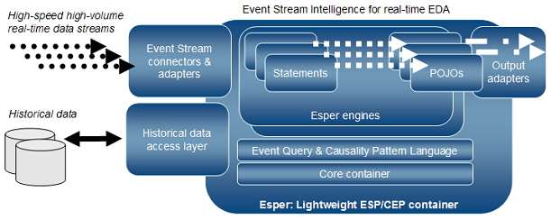

# Esper CEP - 1. Overview

Esper는 실시간 분석의 대표적인 CEP 오픈 소스 프로젝트이다. 이전부터 관심은 있었지만 볼 기회가 없던 차에, 시간이 남아 돌아 끄적여본다...^^;  
(* Event-driven architecture에 대한 내용은 이전 포스트 참고: [EDA 개념과 Event Processing](https://blog.xenomity.com/EDA-개념과-Event-Processing))

## About Esper
Esper는 ESP/CEP 솔루션이므로 EDA의 특징을 그대로 나타낸다. 여기서는 Esper의 특징만을 간략하게 나열하였다.

- Support ESP/CEP Engine.
- Support Event Processing Language(이하 EPL).
- In-Memory Processing System.
- Lightweight & Embeddable System.
- Support Input/Output Adapter.

Esper의 이벤트 처리 엔진은 JVM 위에서 동작하는 경량의 컨테이너로서, ESP/CEP 형식을 둘 다 제공한다. 단일 JVM에서 1개 이상의 엔진을 구동할 수 있지만 분산 환경을 지원하지는 않는다. 이 부분은 실시간 처리라는 관점에서는 문제가 되지 않지만, 빅데이터 관점에서는 큰 문제로 다가올 수 있다. 분산 캐싱 솔루션이나 다른 방법을 통해 수평 확장(scale-out)과 분산 클러스터링을 검토해 볼 필요가 있어 보인다.

Esper가 제공하는 SQL문과 비슷한 이벤트 처리 언어는 개발자들의 진입 장벽을 낮게 하고 직관성과 표현성을 높여 준다. 이미 JPQL이나 HQL(Hibernate QL)과 같은 SQL-like 언어를 접해본 적이 있다면 익숙할 것이다. 그러나 EDA의 설계 관심사는 도메인 모델이 아닌 '이벤트 모델'이므로, 질의하는 대상은 당연히 이벤트이다. Event-driven programming에 익숙하지 않다면 이벤트에 주안점을 두고 디자인하는 안목을 키울 필요가 있다.

이 외에도 풍부한(?) 입출력 어댑터를 제공하여 불필요한 개발 공수를 줄여 준다.


## Architecture
이벤트를 Esper 엔진으로 전달하면, Esper 엔진은 Statement를 통해 의미 있는 이벤트를 필터링하고 리스너로 통지/가공한다. 그리고 Pre-processing and Post-storing 패러다임에 따라, 가공이 끝난 데이터는 영속화된다. 이는 일반적인 실시간 배치 솔루션(e.g. [Storm](http://storm.apache.org), [Spark](http://spark.apache.org))과는 반대되는 부분이다.
  
- 그림 1. Esper Architecture (출처: www.espertech.com)


## EPL Features
이벤트 검출 구문인 EPL은 다음과 같은 특징을 지닌다.

- SQL likely statement.
- Sub-query, Join, Outer Join, Group by/Having, Limitation 구문 제공.
- 외부 저장소나 데이터베이스와 Join 가능.
- Pattern Matching.
- Event Filtering.
- Window(time, time_batch, length, length_batch).

EPL은 SQL과 구조가 비슷하지만 질의 대상은 이벤트이고, 표현식에 부합되면 Esper 엔진을 통해 이벤트를 통지한다. Window와  패턴 매칭을 사용하면 좀 더 고수준의 이벤트 검출이 가능하다. 내용이 좀 방대하긴 하나, 간추린 내용은 다음 포스팅으로 다뤄보련다...


## Input/Output Adapter
CSV/XML File, Socket/HTTP/IMAP, JDBC, JMS 등 다양한 입출력 어댑터를 제공하고 있다. 필요에 의해 적절하게 사용할 수 있다.  
(* See [Adapter Overview](http://www.espertech.com/esper/release-5.3.0/esperio-reference/html/adapter_overview.html))


## Quickstart~!
Esper의 튜토리얼은 [공식 사이트 문서](http://www.espertech.com/esper/quickstart.php)를 참고하기 바란다. 여기서는 간략한 코드 예만 살펴본다. Esper의 최신 버전은 현재일자 기준 5.2.0이다.
```xml
<dependency>
    <groupId>com.espertech</groupId>
    <artifactId>esper</artifactId>
    <version>5.2.0</version>
</dependency>
```
- 예 1. Maven Dependency

### - Event 작성
이벤트 모델은 일반적인 POJO, Map, XML 등의 형식으로 작성할 수 있다. 다음은 POJO로 작성된 이벤트 모델의 예이다.
```java
package com.xenomity.esper.event;

public class OrderEvent {
    private String itemName;
    private double price;

    public OrderEvent(String itemName, double price) {
        this.itemName = itemName;
        this.price = price;
    }

    public String getItemName() {
        return itemName;
    }

    public double getPrice() {
        return price;
    }
}
```
- 예 2. Java Event Bean Class

### - Esper Engine 초기화
Esper 엔진의 설정은 programatic하게 코딩할 수도 있지만, 별도의 정적 파일로 정의할 수도 있다. 따로 리소스 위치를 지정하지 않는다면 디폴트로 클래스패스의 최상위 위치에 `esper.cfg.xml` 파일을 찾는다. 다음은 특정 패키지에 존재하는 이벤트 클래스를 자동으로 찾아, 이벤트 형식으로 엔진에 등록하는 예이다. 참고로 이벤트 형식 이름은 별칭을 따로 주지 않는다면 클래스명을 따른다.
```xml
<?xml version="1.0" encoding="UTF-8"?>
<esper-configuration xmlns:xsi="http://www.w3.org/2001/XMLSchema-instance"
	xmlns="http://www.espertech.com/schema/esper"
	xsi:schemaLocation="http://www.espertech.com/schema/esper http://www.espertech.com/schema/esper/esper-configuration-5.0.xsd">

	<event-type-auto-name package-name="com.xenomity.esper.event" />
</esper-configuration>
```
- 예 3. Esper Configuration File (esper.cfg.xml)

설정 파일을 로드하고 Esper 서비스 제공자(`EPServiceProvider`)를 획득하면 Esper를 사용할 준비가 된 것이다.
```java
Configuration esperConfig = new Configuration();
esperConfig = esperConfig.configure();  // find default configuration file.

EPServiceProvider epService = EPServiceProviderManager.getProvider(DEFAULT_CEP_ENGINE_NAME, esperConfig);
```
- 예 4. Esper Engine Initialize

### - Create a Statement
이벤트를 필터링하는 구문(Statement)을 EPL을 사용하여 `EPServiceProvider`로 등록한다. 아래 EPL은 30초 동안 발생하는 OrderEvent의 평균 가격을 구하는 예이다.
```java
String epl = "select avg(price) from OrderEvent.win:time(30 sec)";
EPStatement epStatement = epService.getEPAdministrator().createEPL(epl);

```
- 예 5. EPL Statement

### - Adding a Listener
특정 Statement 조건에 맞는 이벤트가 검출된 경우, Esper 엔진은 해당 Statement에 등록된 모든 리스너에게 변경을 통지한다. 리스너는 `UpdateListener`를 구현하며, 전달받은 이벤트 모델을 적절히 가공하고 출력 어댑터를 통해 데이터를 영속화한다. 여기서는 -예.5-에서 등록한 Statement에 이벤트 리스너를 등록하고 있다.
```java
epStatement.addListener(new UpdateListener() {
    public void update(EventBean[] newEvents, EventBean[] oldEvents) {
        System.out.println("avg=" + newEvents[0].get("avg(price)"));
    }
});
```
- 예 6. Anonymous Update Listener

### - Sending Events
실제 런타임 환경에서는 정보의 흐름으로부터 이벤트를 생성하고 Esper 엔진으로 푸쉬(push)해 주어야 한다. Esper 엔진은 이벤트가 유입되면, 등록된 Statement들에 부합하는 이벤트를 걸러내고 해당 Statement에 등록된 리스너로 이벤트 처리를 위임한다.
```java
OrderEvent event = new OrderEvent("shirt", 74.50);
epService.getEPRuntime().sendEvent(event);
```
- 예 7. Sending Event


## References
- EsperTech: [http://www.espertech.com](http://www.espertech.com)
- Esper Quickstart: [http://www.espertech.com/esper/quickstart.php](http://www.espertech.com/esper/quickstart.php)
- EDA 개념과 Event Processing: [https://www.xenomity.com/EDA-개념과-Event-Processing](https://www.xenomity.com/EDA-개념과-Event-Processing)
