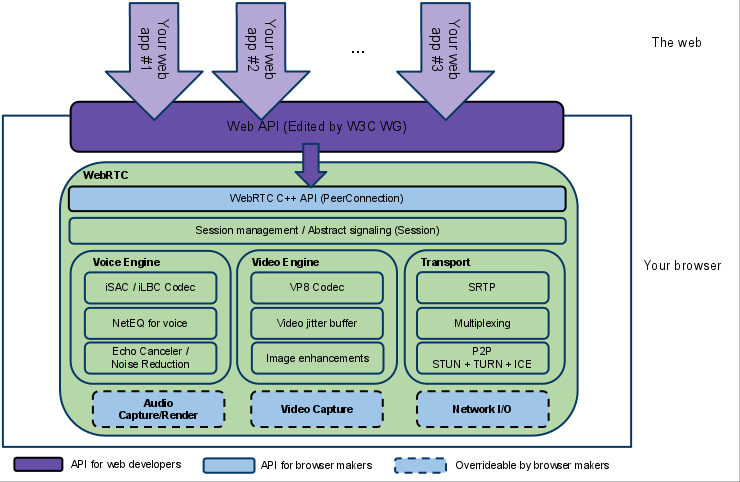
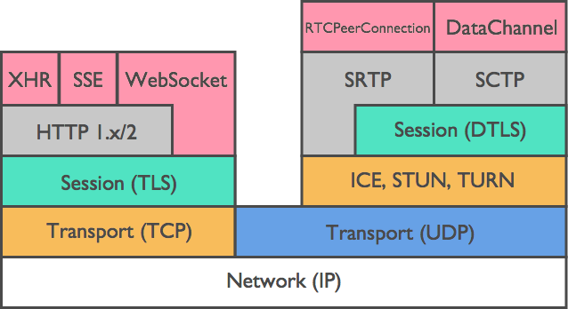
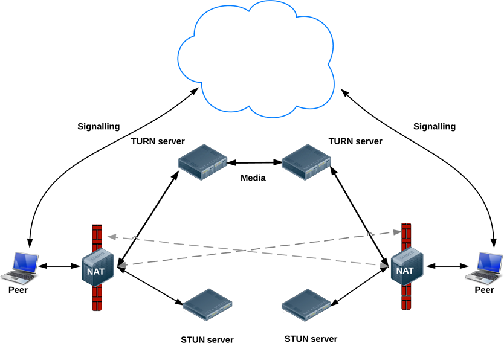
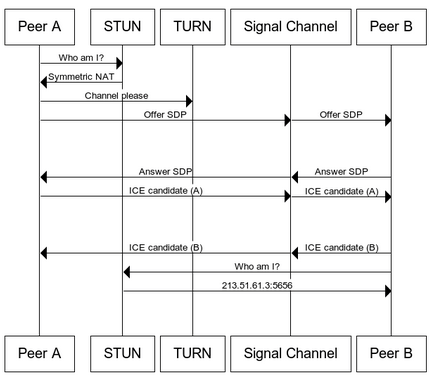
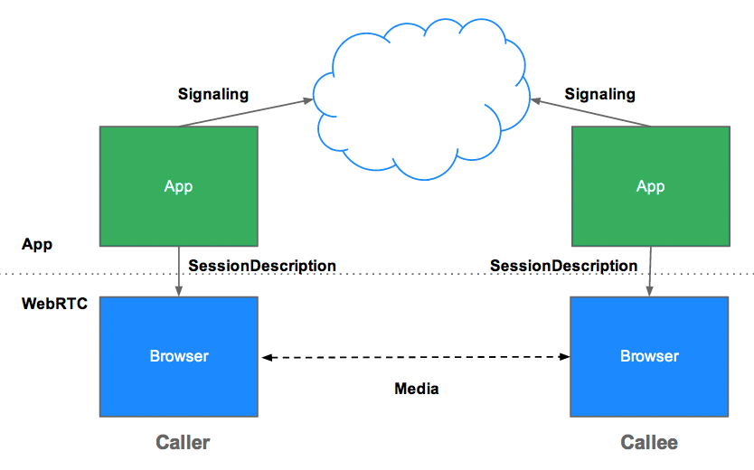

# Overall Design
## WebRTC Media Engine

- Packet loss concealment.
- Echo cancellation.
- Bandwidth adaptivity.
- Dynamic jitter buffering.
- Automatic gain control.
- Noise reduction and suppression.
- Image 'cleaning'.

## Protocol Stack

- Real Time Transport Protocol, RTP.
  - IP를 통해 미디어를 전달하기 위한 패킷 포맷을 정의.
  - UDP/IP 위에서 동작.
  - Uni-direction.
  - 헤더에 코덱 정보 포함 – 유동성 있는 Video, Audio 품질 전송 가능.
- Real Time Control Protocol, RTCP.
  - RTP 데이터의 전송 상태 감시, 세션 관련 정보 전송 (상태 점검을 위한 Protocol) – Flow Control.
  - Report Packet : 보낸 패킷, 손실된 패킷, 패킷 수신 간격 변화.
  - Bi-direction.
- Datagram Transport Layer Security, DTLS.
  - TLS를 UDP에 적용할 수 있는 보안 프로토콜.
- User Datagram Protocol, UDP.
- Stream Control Transmission Protocol, SCTP.
- Interactive Connectivity Establishment, ICE.
- Using by Session Description Protocol, SDP.
- Session Traversal Utilities for NAT, STUN.
  - RFC 5389에 의거, 피어 발견을 위한 네트워크 프로토콜.
- Traversal Using Relays around NAT, TURN.
  - 종단 간 P2P 연결이 실패할 경우, 공용망에 위치한 서버를 통해 패킷을 중계.
  
  

## Core Specification
### MediaStream (a.k.a `getUserMedia()`)
- Capture audio and video. (HTTPS only)
- Constraints
  - e.g.,
    ```javascript
    {
        audio: false,
	    video: {
		    mandatory: {
		        maxWidth: 640,
		        maxHeight: 480
		    }
        }
    }
    ```
		
- MediaStreamTracks
  - `getAudioTracks()`
  - `getVideoTracks()`
- (_* 현재 일자 기준, WebRTC Screen Sharing을 위한 getDisplayMedia() 함수 구현이 시험중에 있다._)
	
### MediaRecorder
- Record audio and video.
	
### RTCPeerConnection
- Stream audio and video between users.
- Implementations
  - Chrome: `webkitRTCPeerConnection`
  - Firefox: `mozRTCPeerConnection`
- Signaling
  - WebRTC 비-명세.
  - Roles.
    - Session control messages.
	- Network configuration.
	- Media capabilities.
  - Plus Servers
	- 사용자 탐색과 통신.
	- Signaling.
	- NAT/Firewall 탐색. (*i.e., STUN, TURN*)
	- P2P 실패를 대비한 중계 서버. (*i.e., TURN, Relay*)
- ICE Framework.
  - Finding Candidate.
	- UDP -> HTTP(TCP) -> HTTPS -> TURN.
	- See https://blog.xenomity.com/ice_interactive_connectivity_protocol
	- Workflow
    
    
  - Session Description Protocol, SDP.
	- (from JavaScript Session Establishment Protocol, JSEP)
	  - Offer.
	  - Answer.
	- Media meta-data, codec, resolution, bandwidth, etc…
	- See https://blog.xenomity.com/sdp_session_description_protocol
- Sequence.
  - Offer <-> Signal Server <-> Answer 간 통신. (Connection, SDP 송/수신, Candidate)
  - (*) Google Public STUN Server: 'stun.l.google.com:19302'

### RTCDataChannel
- Streaming data between users.
  - i.e., text, file, binary, anybody…
- Features.
  - RTCPeerConnection 세션 설정의 레버리징.
  - 우선순위가 있는 여러 개의 동시 채널.
  - 신뢰/비신뢰 전달 시멘틱.
  - Built-in security(DTLS) & 혼잡 제어.
  - Very fast~!!


## JSEP Architecture

- JSEP는 초기 제안 뒤에 피호출자에 대한 후보들을 증분 제공하는 호출자를 가능하게 하는 ICE Candidate Trickling와 피호출자에게 호출시 동작을 시작하고 도착한 모든 후보들에 대한 대기없이 연결을 설정할 수 있는 기능을 지원.


# References
- [RFC 7742] WebRTC Video Processing and Codec Requirements: https://tools.ietf.org/html/rfc7742
- [RFC 3550] RTP: Real-Time Protocol: https://tools.ietf.org/html/rfc3550
- [RFC 6184] RTP Payload Format for H264: https://tools.ietf.org/html/rfc6184
- SDP for WebRTC: https://tools.ietf.org/html/draft-ietf-rtcweb-sdp-11
- [RFC 4566] SDP: Session Description Protocol: https://tools.ietf.org/html/rfc4566
- [RFC 8445] ICE: Interactive Connectivity Establishment: https://tools.ietf.org/html/rfc8445
- [RFC 5245] ICE for SDP: https://tools.ietf.org/html/rfc5245
- Getting Started: https://webrtc.org/start
- Code Samples: https://github.com/webrtc/samples
- WebRTC Samples: https://webrtc.github.io/samples
- HTML5Lock Tutorial: 
  - https://www.html5rocks.com/ko/tutorials/webrtc/basics
  - https://www.html5rocks.com/ko/tutorials/webrtc/infrastructure
  - https://www.html5rocks.com/ko/tutorials/webrtc/datachannels
- Capturing Audio & Video in HTML5: https://www.html5rocks.com/ko/tutorials/getusermedia/intro
- Codelabs: https://codelabs.developers.google.com/codelabs/webrtc-web
- HTML5 WebSocket: https://dzone.com/refcardz/html5-websocket
- WebRTC OpenSource Signaling Servers:
  - https://github.com/webRTC-io/webRTC.io
  - https://github.com/priologic/easyrtc
  - https://github.com/andyet/signalmaster
- Mozilla Tutorial: https://developer.mozilla.org/ko/docs/Web/API/WebRTC_API/Signaling_and_video_calling
