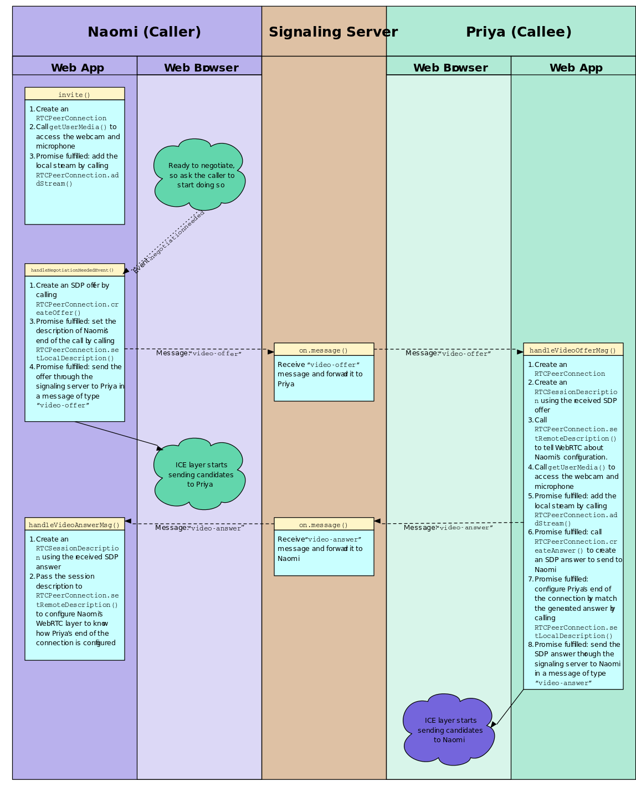

종단 간 상호 미디어 규약 협의를 위하여 WebRTC는 세션 기술 프로토콜(Session Description Protocol, SDP) 협상 모델을 사용한다. SDP 전문은 각 클라이언트가 교환할 상세 미디어 프로토콜 규약과 옵션을 포함하며, 한 피어에서 제안(Offer)하고 다른 피어에서 응답(Answer)하는 형태의 협상 프로세스를 시도한다. 상호 교환 가능한 규약으로 SDP 협상이 완료되면, WebRTC 구현체는 ICE 후보 교환, peer connection handshaking과 같은 이후 단계를 수행하게 된다.

- See https://tools.ietf.org/html/rfc4566


### SDP Generation Code
- 예 1. SDP Offer
  `RTCPeerConnection.createOffer(successCallback, failureCallback[, options]);`
  프레임워크는 코드가 수행되는 플랫폼에서 교환 가능한 미디어 프로필을 포함하여 SDP 제안 템플릿을 생성한다.

- 예 2. SDP Answer
  `RTCPeerConnection.createAnswer(successCallback, failureCallback[, options]);`
  프레임워크는 코드가 수행되는 플랫폼에서 교환 가능한 미디어 프로필을 포함하여 SDP 응답 템플릿을 생성한다.

```
SDP Specification Sample
v=0
o=Kim 6137031273746274589 2 IN IP4 127.0.0.1
s=1234567890
t=0 0
a=group:BUNDLE audio video data
a=msid-semantic: WMS vrogvdX9SLeto3IhVm6C1cFS2fRIFqRMlPzd
m=audio 9 UDP/TLS/RTP/SAVPF 111 103 104 9 0 8 126
c=IN IP4 0.0.0.0
a=rtcp:9 IN IP4 0.0.0.0
a=ice-ufrag:eWXl
a=ice-pwd:57FcQfoChjtjaMlHOlp6TPGE
a=fingerprint:sha-256 EB:E1:55:0E:41:99:0C:C0:CC:C8:43:9B:99:11:F9:A1:4D:77:5C:A1:BF:70:78:B0:19:30:04:D8:D3:11:DC:0D
a=setup:actpass
a=mid:audio
b=AS:32
a=extmap:1 urn:ietf:params:rtp-hdrext:ssrc-audio-level
a=extmap:3 http://www.webrtc.org/experiments/rtp-hdrext/abs-send-time
a=sendrecv
a=rtcp-mux
a=rtpmap:111 opus/48000/2
a=rtcp-fb:111 transport-cc
a=fmtp:111 minptime=10;useinbandfec=1
a=rtpmap:103 ISAC/16000
a=rtpmap:104 ISAC/32000
a=rtpmap:9 G722/8000
a=rtpmap:0 PCMU/8000
a=rtpmap:8 PCMA/8000
a=rtpmap:126 telephone-event/8000
a=ssrc:4294317716 cname:rMz9sLiEHfqP6GNx
a=ssrc:4294317716 msid:vrogvdX9SLeto3IhVm6C1cFS2fRIFqRMlPzd dbf5d9a8-8135-4e0d-87f0-d2b6b7d326b3
a=ssrc:4294317716 mslabel:vrogvdX9SLeto3IhVm6C1cFS2fRIFqRMlPzd
a=ssrc:4294317716 label:dbf5d9a8-8135-4e0d-87f0-d2b6b7d326b3
m=video 9 UDP/TLS/RTP/SAVPF 100 101 107 116 117 96 97 99 98
c=IN IP4 0.0.0.0
a=rtcp:9 IN IP4 0.0.0.0
a=ice-ufrag:eWXl
a=ice-pwd:57FcQfoChjtjaMlHOlp6TPGE
a=fingerprint:sha-256 EB:E1:55:0E:41:99:0C:C0:CC:C8:43:9B:99:11:F9:A1:4D:77:5C:A1:BF:70:78:B0:19:30:04:D8:D3:11:DC:0D
a=setup:actpass
a=mid:video
b=AS:1500
a=extmap:2 urn:ietf:params:rtp-hdrext:toffset
a=extmap:3 http://www.webrtc.org/experiments/rtp-hdrext/abs-send-time
a=extmap:4 urn:3gpp:video-orientation
a=extmap:5 http://www.ietf.org/id/draft-holmer-rmcat-transport-wide-cc-extensions-01
a=extmap:6 http://www.webrtc.org/experiments/rtp-hdrext/playout-delay
a=recvonly
a=rtcp-mux
a=rtcp-rsize
a=rtpmap:100 VP8/90000
a=fmtp:100 x-google-start-bitrate=600; x-google-min-bitrate=600; x-google-max-bitrate=1500; x-google-max-quantization=56
a=rtcp-fb:100 ccm fir
a=rtcp-fb:100 nack
a=rtcp-fb:100 nack pli
a=rtcp-fb:100 goog-remb
a=rtcp-fb:100 transport-cc
a=rtpmap:101 VP9/90000
a=rtcp-fb:101 ccm fir
a=rtcp-fb:101 nack
a=rtcp-fb:101 nack pli
a=rtcp-fb:101 goog-remb
a=rtcp-fb:101 transport-cc
a=rtpmap:107 H264/90000
a=rtcp-fb:107 ccm fir
a=rtcp-fb:107 nack
a=rtcp-fb:107 nack pli
a=rtcp-fb:107 goog-remb
a=rtcp-fb:107 transport-cc
a=fmtp:107 level-asymmetry-allowed=1;packetization-mode=1;profile-level-id=42e01f
a=rtpmap:116 red/90000
a=rtpmap:117 ulpfec/90000
a=rtpmap:96 rtx/90000
a=fmtp:96 apt=100
a=rtpmap:97 rtx/90000
a=fmtp:97 apt=101
a=rtpmap:99 rtx/90000
a=fmtp:99 apt=107
a=rtpmap:98 rtx/90000
a=fmtp:98 apt=116
m=application 9 DTLS/SCTP 5000
c=IN IP4 0.0.0.0
a=ice-ufrag:eWXl
a=ice-pwd:57FcQfoChjtjaMlHOlp6TPGE
a=fingerprint:sha-256 EB:E1:55:0E:41:99:0C:C0:CC:C8:43:9B:99:11:F9:A1:4D:77:5C:A1:BF:70:78:B0:19:30:04:D8:D3:11:DC:0D
a=setup:actpass
a=mid:data
b=AS:1638400
a=sctpmap:5000 webrtc-datachannel 1024
```

## SDP Global Lines
`v=0`
SDP Protocol Version. Default 0.

`o=Kim 6137031273746274589 2 IN IP4 127.0.0.1`
SDP 문서를 생성한 피어 식별자.
- Format
  `o=${user name} ${session id} ${session version} ${network type} ${address type} ${unicast address}`

`s=1234567890`
Session Name.

`t=0 0`
세션 활성화 시간. 고정 세션의 경우 '0 0'으로 설정하며, 이는 세션이 만료되지 않는 영구적임을 의미한다.
- Format
  `t=${시작시간} ${종료시간}`

`a=group:BUNDLE audio video data`
SDP에 사용-정의한 미디어 번들 그룹. 다음 행에 대응.
```
a=mid:audio
…
a=mid:video
…
a=mid:data
…
```

## SDP Media Lines
```
m=audio 9 UDP/TLS/RTP/SAVPF 111 103 104 9 0 8 126
…
m=video 9 UDP/TLS/RTP/SAVPF 100 101 107 116 117 96 97 99 98
…
m=application 9 DTLS/SCTP 5000
…
```

미디어 스트림에 관한 속성과 정보들을 정의하는 미디어 라인을 의미.
- Format
  `m=${미디어 타입 (audio | video | application)} ${포트 번호} ${프로토콜} ...${RTP payload type 순서}`
- Ref: http://blog.xenomity.com/RTP_Payload_Type

피어 간의 협상 과정에서 우선되는 프로파일 번호를 순서대로 시험한다. 예를 들어 111번에 해당하는 코덱이 상호간에 가능한지 확인하고 가능하지 않다면 103번으로 다시 협상한다.
미디어라인은 복수개로 선언 가능하며, 하위에는 해당 미디어에 대한 협상 내용만 정의한다. 즉, 순서가 중요하다.

`c=IN IP4 0.0.0.0`
피어 연결을 위한 접근 가능한 주소를 노출한다. 일반적으로 ICE 후보군에서 접근 가능한 주소를 별도로 시험하게 되므로 c 라인의 주소는 사용되지 않는다.

`a=rtcp:9 IN IP4 0.0.0.0`
RTCP 연결을 위한 주소 및 포트를 지정한다. rtcp-mux를 사용하는 경우, RTP와 동일한 포트가 된다.

```
a=ice-ufrag:eWXl
a=ice-pwd:57FcQfoChjtjaMlHOlp6TPGE
```

ICE 속성 값들을 정의. ICE 후보가 교환되고 나면, 서로를 확인하는 프로세스가 시작되는데 이 때 사용되며 세션과 관련되지 않는 잠재적인 공격을 받지 않도록 한다.

`a=fingerprint:sha-256 EB:E1:55:0E:41:99:0C:C0:CC:C8:43:9B:99:11:F9:A1:4D:77:5C:A1:BF:70:78:B0:19:30:04:D8:D3:11:DC:0D`
DTLS 속성 값을 정의. DTLS-SRTP 협상에 사용되는 인증서의 암호화 해시를 포함.

`a=setup:actpass`
DTLS 협상을 시작할 수 있는 피어임을 정의. RFC4145에 의해 정의 되었으며 RFC4572에 의해 갱신되었다.

```
a=mid:audio
…
a=mid:video
...
```

BUNDLE 그룹에 사용되는 미디어 식별자.

`b=AS:32`
Available Send. 전송 가능한 최대 대역폭을 의미. 기본 SDP 템플릿에는 포함되지 않으며, 애플리케이션에서 임의로 추가 가능한 설정이다.
위 예의 경우, 미디어에 대해 32kbps로 최대 대역을 설정한다.

`a=sendrecv`
미디어의 교환 방향을 표시한다.
SDP 를 생성할 때 사용하는 createOffer, createAnswer 함수의 option 지정을 통해 sendonly, recvonly, inactive 형태로 변경할 수 있다.

```
a=rtpmap:111 opus/48000/2
a=rtpmap:100 VP8/90000
```

특정 코덱에 관한 명시자이다
Opus의 경우, 프로파일 번호는 111이며 48000Hz의 샘플링 주기를 가지고 2채널을 사용한다. 여기서 프로파일 번호는 m 미디어 라인에서 사용되는 미디어 프로파일 번호와 일치한다.

```
a=fmtp:111 minptime=10;useinbandfec=1
a=fmtp:107 level-asymmetry-allowed=1;packetization-mode=1;profile-level-id=42e01f
```

특정 코덱에 대한 옵션 기술자이다.
Codec specific option(e.g., encoding parameters…)을 기술한다.

`a=sctpmap:5000 webrtc-datachannel 1024`
데이터 채널에 대한 명시자이다.
- Format
  `a=sctpmap:${포트} webrtc-datachannel ${최대 메시지 크기}`

```
a=ssrc:4294317716 cname:rMz9sLiEHfqP6GNx
a=ssrc:4294317716 msid:vrogvdX9SLeto3IhVm6C1cFS2fRIFqRMlPzd dbf5d9a8-8135-4e0d-87f0-d2b6b7d326b3
a=ssrc:4294317716 mslabel:vrogvdX9SLeto3IhVm6C1cFS2fRIFqRMlPzd
a=ssrc:4294317716 label:dbf5d9a8-8135-4e0d-87f0-d2b6b7d326b3
```

미디어 소스 속성에 대한 기술자이다.
- cname: Canonical End-point id.
- msid: Media stream id (+ track id).
- label, mslabel: Deprecated by msid.


## Codec Priority
`m=video 9 UDP/TLS/RTP/SAVPF 100 101 107 116 117 96 97 99 98`
피어 간 협상 과정에서 상호 적용할 수 있는 코덱의 우선순위를 변경할 수 있다.
비디오를 예를 들어 VP8 코덱이 아닌 H.264를 우선 적용하고 싶다면, H.264에 해당하는 미디어 프로파일 번호를 가장 앞으로 변경할 수 있다.
위 전문 예에서 H.264의 프로파일 번호는 107이다. 107을 VP8 프로파일 번호인 100번 앞으로 순서를 변경하여 협상 우선순위를 높일 수 있다.
`m=video 9 UDP/TLS/RTP/SAVPF 107 100 101 116 117 96 97 99 98`


SDP Offer/Answer Signaling

  - 출처. Mozilla.


## References
- [RFC 4566] SDP: Session Description Protocol: https://tools.ietf.org/html/rfc4566
- RTP Payload Types: https://en.wikipedia.org/wiki/RTP_audio_video_profile
- SDP Anatomy: https://webrtchacks.com/sdp-anatomy/