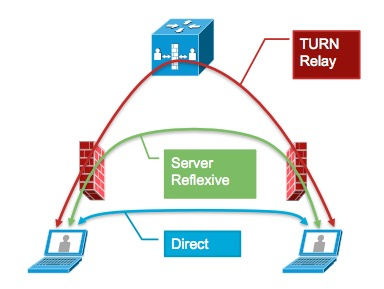
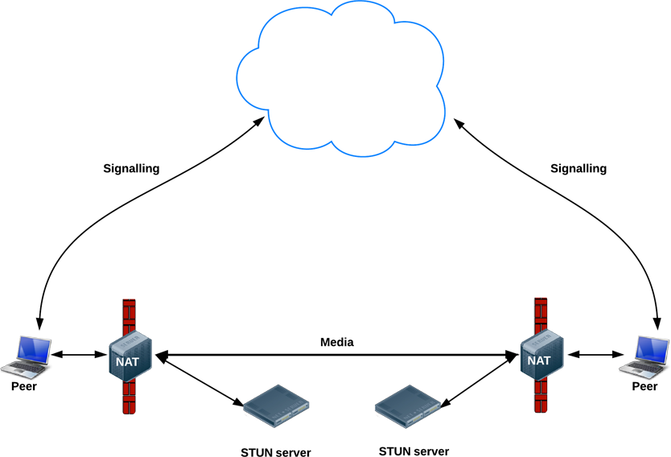
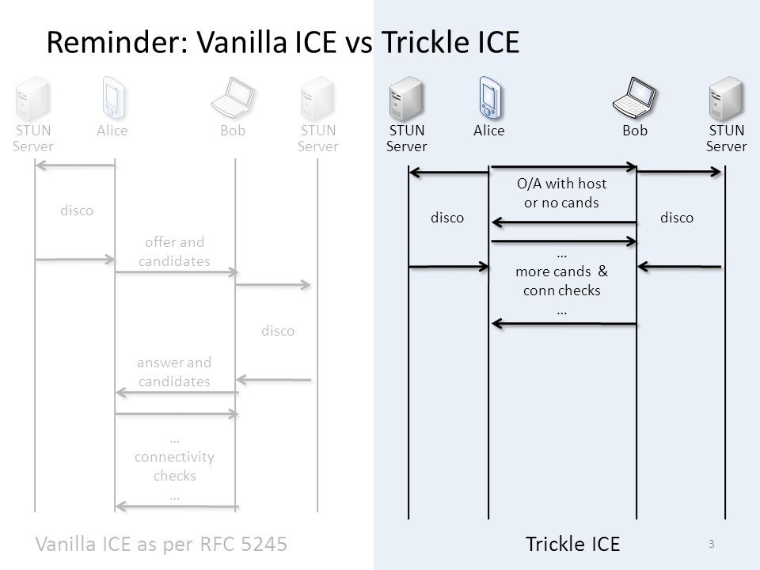
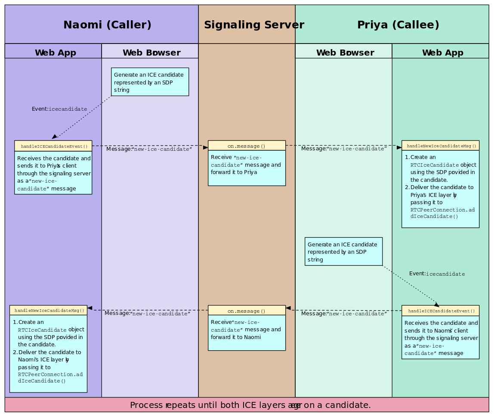

ICE 에이전트는 클라이언트의 로컬 주소 및 STUN과 연계하여 식별 가능한 모든 주소를 수집한다.
-  Refs [RFC-5245](https://tools.ietf.org/html/rfc5245).

## ICE Candidate Type
- `host`
	- Host Candidates.
	- 클라이언트의 사설 주소. 랜과 무선-랜 등 다수 인터페이스에 IP가 매핑되어 있으면 모든 주소가 후보가 된다.
- `srflx`
	- Server Reflexive Candidates.
	- NAT 장비가 매핑한 클라이언트의 공인망 주소로 STUN에 의해 판단한다.
- `prflx`
	- Peer Reflexive Candidates.
	- ICE 에이전트가 연결성 시험을 하는 과정에서 피어가 포트 보존이 되지 않는 Symmetric NAT 뒤에 위치하는 경우, STUN에 의해 새로운 바인딩 경로를 찾을 수 있다.
	- (_* Symmetric NAT는 바인딩을 위한 포트를 임의로 생성하기 때문._)
- `relay`
	- Relayed Candidates.
	- 패킷 릴레이를 위해 할당하는 TURN 서버 주소.


## Workflow


ICE 에이전트는 연결 가능한 모든 정보를 수집하고, 최적화된 경로에 우선 순위를 부여한다. 그리고 우선 순위가 높은 경로 순으로 각각 연결을 시험하여 최종적으로 연결 가능한 경로(i.e., candidate pair)로 피어 연결을 시도한다.

다음은 브라우저에서 수집된 ICE 후보군의 예 이다.
```
{"sdpMid": "audio", "sdpMLineIndex": 0, "candidate": "candidate:234234345 1 udp 3274347843 52.1.23.124 1024 typ srflx raddr 172.20.2.131 rport 39191 generation 0 ufrag GHep network-cost 50"}
```

- Format
`Candidate:${후보 ID} ${RTCP 여부(0|1)} ${프로토콜} ${우선 순위} ${연결 주소} typ ${후보 타입} raddr ${원격 주소} rport ${원격 포트} generation 0 ufrag ${ICE uFrag} network-cost ${네트워크 비용}`
- 우선 순위의 경우, RFC 5245에 정의된 방식으로 계산된 값을 표현한다.
- 프로토콜의 경우, ICE-TCP를 사용하지 않는 한 일반적으로 UDP이다.
- 후보 타입의 경우, 위에 언급한 ICE Candidate Type(*i.e., `host`, `srflx`, `prflx`, `relay`*) 연결 타입을 표현한다.

### 일반적인 WebRTC 연결의 예.


  - 출처: Sam Dutton (HTML5 Rocks)

### TURN 서버를 통한 WebRTC 연결의 예.


  - 출처: Sam Dutton (HTML5 Rocks)


### RFC 5245 Vanilla ICE vs Trickle ICE
대다수의 브라우저는 피어 연결을 극대화하기 위하여 Trickle ICE 명세를 지원한다.


  - 출처: draft-ivov-mmusic-trickle-ice


### ICE Candidate Exchange
각 피어는 브라우저에서 비-동기적으로 발생하는 ICE 후보를 시그널링 채널을 통해 상호 교환한다.


  - 출처. Mozilla.


## References
- SDP: Session Description Protocol: https://blog.xenomity.com/SDP-Session-Description-Protocol
- RFC 5245: https://tools.ietf.org/html/rfc5245
- Mozilla Tutorial: https://developer.mozilla.org/ko/docs/Web/API/WebRTC_API/Signaling_and_video_calling
