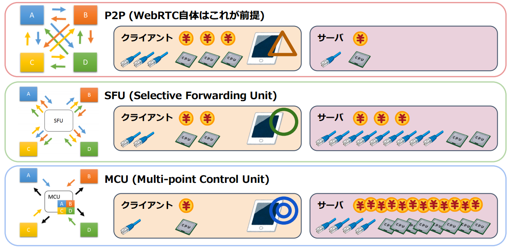

WebRTC는 기본적으로 P2P 프로토콜로서, 대규모의 미디어 방송 서비스를 구축하거나 나 컨텐츠 가공이 필요한 경우와 같이, 서비스 목적에 따라 별도의 중앙 서버를 구성해야 할 필요가 있다. 아키텍처는 유즈케이스에 따라 다음과 같은 구성을 고려해 볼 수 있다.

  - 그림 1. P2P vs SFU vs MCU

## P2P (Peer to Peer)
중앙 서버 없이 종단 간 직접 연결 방식은 비용 측면에서 유리하나, 피어 수가 증가(mesh structure)할수록 시스템과 네트워크의 높은 capacity를 요구한다. 1:1 또는 소규모 미디어 교환에 적합하다.

## SFU (Selective Forwarding Unit)
중앙 서버를 통해 종단 간 미디어 트래픽을 중계하는 중앙 서버 방식으로, 각 피어 연결 할당 및 decrypt/encrypt 처리 비용 정도를 감수한다. 영상 방송과 같은 1:M(or minimum-N:M) 스트리밍 서비스 구조에 적합하다.

## MCU (Multi-point Control Unit)
다수의 송출 미디어를 중앙 서버에서 혼합(muxing) 또는 가공(transcoding)하여 수신측으로 전달하는 중앙 서버 방식으로, 클라이언트와 네트워크의 부담이 현저히 줄어드는 반면 중앙 서버의 높은 컴퓨팅 파워가 요구된다. 

|     | P2P | SFU | MCU |
|-----|:---:|:---:|:---:|
| Client Uplink | High | Low | Low |
| Client Downlink | High | Low | High |
| Client CPU Usage | High | Low | Medium |
| Server CPU Usage | - | High | Low |
| Possible Latency | Depends on Network Bandwidth | Depends on CPU Power | Depends on Network Bandwidth |
| Transcode Capability | - | Yes | No |
| Simulcast/SVC Capability | - | - | Yes |

## Conclusion
서비스 목표와 비용 등 유즈케이스에 적합한 설계가 필요하다. 대게 소규모 음성/영상 통화는 P2P, 중급 규모 이상의 단방향 방송(*e.g., e-Learning, Broadcasting, etc…*)이나 화상 회의와 같은 목적의 서비스는 SFU, 대규모 음성 대화(*e.g., voice mixing*)나 실시간 관제 시스템(*e.g., grid video transcoding*)과 같은 목적의 서비스는 MCU를 우선 염두하여 설계한다.

참고로, MCU는 낡은 기술이고 서버 운용 비용이 매우 높으므로, WebRTC와 같은 실-시간성 보장이 중요한 서비스의 경우 그 장점을 상쇄시켜 버린다. MCU 사용은 최대한 배제하고 다른 프로토콜 적용을 고려해 볼 필요가 있다.
