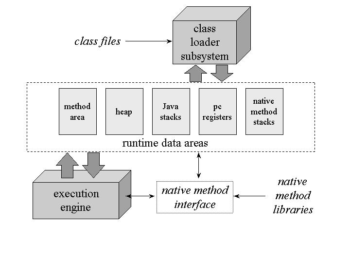

# JVM 메모리 구조
JVM은 OS 위에서 하나의 프로세스로 동작한다. 자바 애플리케이션이 실행되면 JVM은 OS로부터 실행에 필요한 자원을 할당받고 JVM이 필요로 하는 메모리 영역을 용도에 따라 분리하여 관리하게 된다. 이 메모리를 **Runtime Data Areas**라고 하는데, JVM은 런타임 시점에 `Class Loader`를 통해 필요한 클래스들의 정보를 분석하고 각 메모리 영역별로 적재한다. 아래 그림은 **Runtime Data Areas**를 도식화한 것이다.

- 그림 1. JVM Memory. (출처: Sun)

## Runtime Data Areas
JVM은 용도에 따라 5가지 메모리 영역으로 분리하여 관리한다.

### Method Area
Method의 Bytecode, 클래스 변수가 적재되는 **공유 메모리** 영역이다. JVM은 실행 시점에 특정 클래스가 사용되면 이에 해당하는 클래스의 변수와 메서드 코드를 분석하고 저장한다. JVM 전반에 걸쳐 공유되는 정보를 가지게 되므로 공유 메모리라고도 하며, **Constant Pool**도 이 영역에 위치한다.

### Heap
런타임 시점에 생성되는 클래스의 인스턴스와 변수가 적재되는 공간이다. 가장 큰 영역을 확보하게 되며 GC의 대상이 되는 공간이기도 하다. 쓰레드별 생성되는 공간인 **Java Stacks**와는 달리, 인스턴스별로 정보가 적재되기에 멀티-쓰레드 환경에서 Thread-Safe한 코드가 요구된다.

### Java Stacks (Call Stacks)
쓰레드별 호출된 메서드의 지역변수, 연산의 임시 중간결과값 등이 적재되는 영역으로서, 메서드의 작업에 필요한 공간을 호출 시점에 할당하고 작업이 완료되면 스택에서 제거한다.

### PC Registers
JVM이 수행할 명령의 주소가 적재되는 영역이다.

### Native Method Stacks
JNI를 통한 Native 언어로 된 코드 실행 시, Native 코드의 메서드 또는 함수의 변수들이 적재되는 영역이다.

# static & final keyword...
클래스 변수에 선언된 `static` 키워드는 **Heap**에 생성된 인스턴스의 참조를 **Method Area**로 할당한다. 즉, 공유 메모리에 클래스 변수로 할당되게 되므로 값은 유일하게 공유된다. 그리고 변수에 선언하는 `final` 키워드의 경우, 변수의 값을 **Method Area** 영역의 -상수 풀(*Constant Pool*)-로 고정하여 상수화한다. 메서드는 호출 스택에서 수행이 끝나면 메모리가 제거되지만, `final` 지역 변수에 의해 고정된 값을 유지할 수 있으므로 내부 익명 클래스처럼 클로저의 자유 변수와 같은 효과를 낼 수 있다.
자바는 GC라는 매커니즘에 의해 메모리 기반 구조를 이해하지 못해도 어느 정도 안전한 코딩이 가능하지만, 더 나은 코딩 습관을 기르기 위해서라면 이러한 기반 내용을 이해하는 것은 매우 중요하다.
