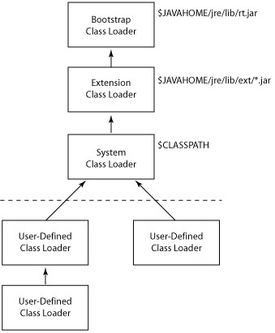

'클래스 로더'란 바이트 코드를 메모리에 동적으로 적재하는 객체를 의미하며, 자바에서는 위와 같은 3단계의 기본 클래스 로더들이 상하 관계를 형성하고 있다. 일반적으로 J2EE 벤더들은 독자적인 hot-deploy 매커니즘을 다루고 있으며 이에 따라 적절한 '사용자 정의 클래스 로더'를 구현하고 있다. 이 말의 의미는 클래스 로더는 얼마든지 변경 가능한 특징을 가지고 있다는 것이다. 다음은 위 그림을 토대로 한 각 클래스 로더의 역할 및 책임을 나열한다.

#### **1. Features**

- Class Loader는 계층형 구조를 갖는다.
- 자식 클래스 로더는 부모 클래스 로더에서 로딩한 객체를 찾을 수 있으며, 그 반대는 불가하다.
- 이미 클래스 로더에 의해 로딩된 클래스는 unload가 불가하다.

  

#### **2. Bootstrap Class Loader**

- 최상위 클래스 로더.
- JVM의 매커니즘에 의해 동작하므로 객체로 인스턴스화 될 수 없다.
- `rt.jar`(자바 표준 패키지)를 포함한 `{JAVA\_HOME}/jre/lib` 경로의 모든 라이브러리에 포함된 핵심 클래스들을 로딩한다.

  

#### **3. Extension Class Loader**

- `{JAVA\_HOME}/jre/lib/ext`에 위치하는 자바 확장 패키지(javax.\*)의 클래스들을 로딩한다.

  

#### **4. System Class Loader**

- Java Class-Path로 지정된 모든 클래스의 로딩을 담당한다.
- 위의 두 클래스 로더와는 달리, 상속 구현을 통하여 얼마든지 확장이 가능하다. (사용자 정의 클래스 로더의 최상위 부모가 된다.)

