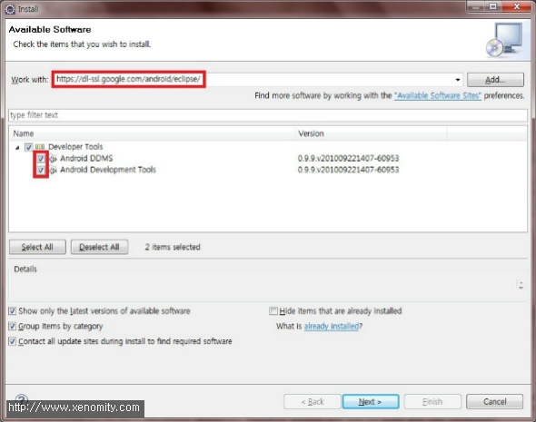
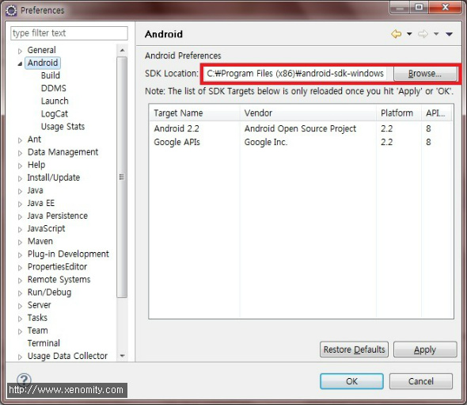
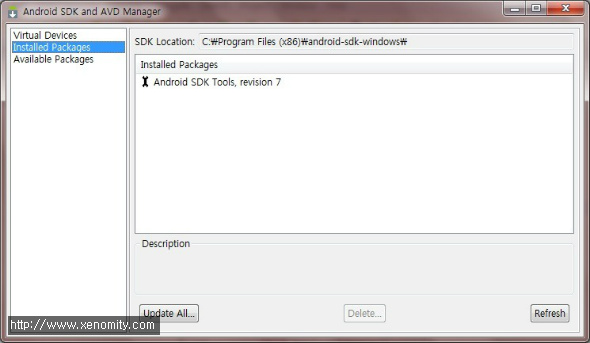
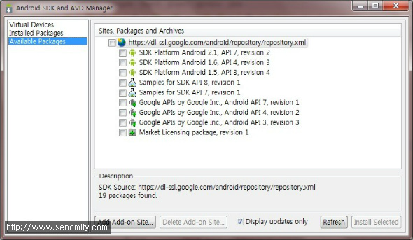
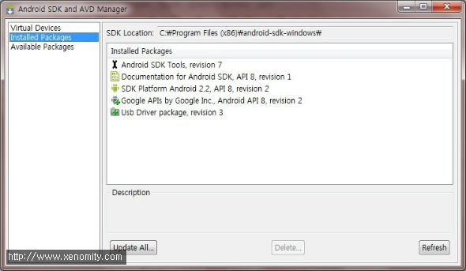
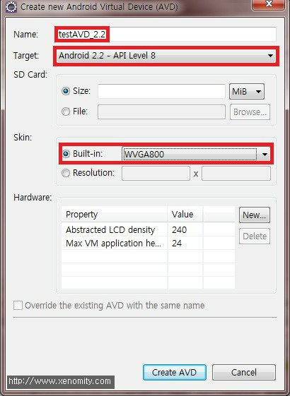
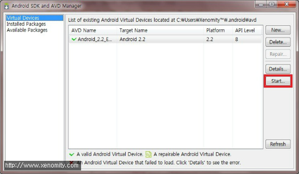
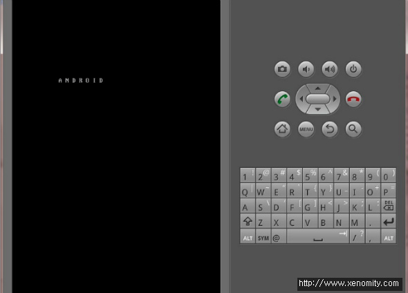

\* Android SDK revision 7, DDMS 0.9 기준으로 작성함.  
  
  

#### **1. Android SDK Download.**
[http://developer.android.com/](http://developer.android.com/) =\> SDK =\> OS에 해당하는 SDK 다운로드.  
임의의 경로에 압축 해제.  
  
  

#### **2. Eclipse Plug-In 설치.**
Help =\> Install New Software =\>  
Work With : [https://dl-ssl.google.com/android/eclipse/](https://dl-ssl.google.com/android/eclipse/)  

  

#### **3. Plug-In과 SDK 연동.**
Windows =\> Preference =\> Android =\> SDK Location 자신의 Android SDK가 설치된 경로를 입력.  

  
ToolBar =\> AVD Manager 버튼 =\> Installed Package =\> 연동된 SDK 버전이 나타난다.  

  

#### **4. Android SDK Available Package 추가.**
ToolBar =\> AVD Manager =\> Available Packages =\> 필요한 최신 패키지 선택.  

  
설치가 완료되면 Installed Packages에서 설치된 패키들의 목록을 확인할 수 있다.  

  

#### **5. Virtual Device 생성.**
ToolBar =\> AVD Manager =\> Virtual Device =\> New  
가상 장치의 Name과 Target, skin의 해상도를 지정한 후, Create AVD.  
(본인은 WVGA 480x800에서 테스트할 목적으로 선택함)  

  

#### **6. Start Virtual Device**
Start...를 클릭하여 가상장치가 제대로 동작하는지 확인.  

  

  
만약 Start...시에 'ERROR: bad config: virtual device directory lacks config.ini' 에러가 발생한다면, 이는 AVD 설정파일이 위치한 경로에 인식할 수 없는 문자셋이 포함되어 있기 때문이다.  
  
해결방법은 다음에 포스트로~ -0-;;;
