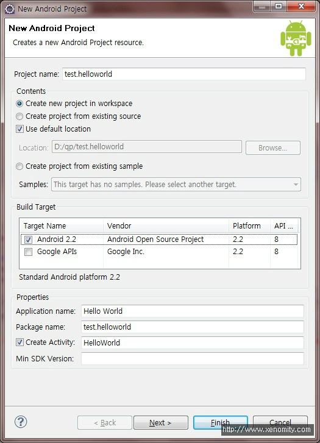
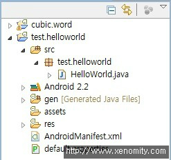

* 본 내용은 JDK 6, Eclipse 3.6, Android SDK Tools (rev.7) 기준으로 작성함.  
  
Android 개발환경 구축 선작업이 되어있지 않은 경우, [Android 개발환경 구축](https://blog.xenomity.com/Android-%EA%B0%9C%EB%B0%9C%ED%99%98%EA%B2%BD-%EA%B5%AC%EC%B6%95) 포스트 참고.  
  
  

## 1. Android Project 생성
New => Project => Android => Android Project  


   1) Project Name : 프로젝트명  
   2) Application Name : 어플리케이션명
   3) Package Names : 식별되는 Package명
   4) Create Activity : Application 단위의 기본 생명주기
   5) Min SDK Version : 최소 실행 가능한 SDK revision 번호 (ex. android 2.2 == revision 8)  
  

## 2. Sample Code 작성


  

정상적으로 프로젝트가 생성되면 위와 같은 구조가 만들어진다.

`test.helloworld.HelloWorld.java`를 수정해보면,  

```java
package test.helloworld;
 
import android.app.Activity;
import android.os.Bundle;
import android.widget.TextView;
 
public class HelloWorld extends Activity {
 
    @Override
    public void onCreate(Bundle savedInstanceState) {
        super.onCreate(savedInstanceState);
         
        TextView textView = new TextView(this);
        textView.setText("요요~~! 안드로이드!!");
         
        setContentView(textView);
    }
}
```


## 3. 실행
Run As => Android Application  


정상적으로 실행된 모습  
  

