Eclipse RCP 한창 열공할때 만들어본 프로그램.  
심심할때마다 계속 업뎃중...

- 개발환경: Eclipse Platform v3.4, JDK 5  
- 목적: 없음;;   
- 기능: 포스트잇, 다국어 번역, 블로그 관리, 화면 캡춰, 시스템 예약 종료, 라디오, 실시간 방송, 실시간 메일 확인/알림, 실시간 RSS/Atom Feed 구독, 간략 시스템 정보, 화면보호기, 코드 템플릿 자동 생성, 파일탐색기, 지도 검색.

스크린샷들~

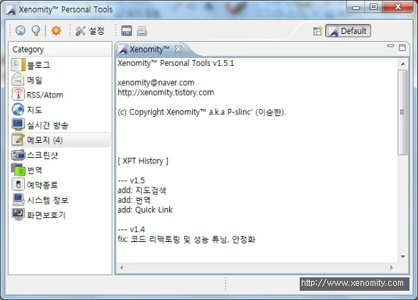

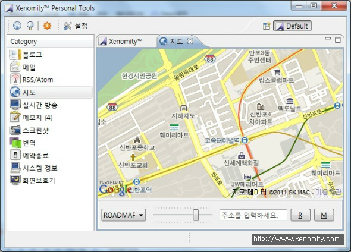

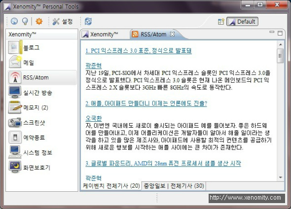

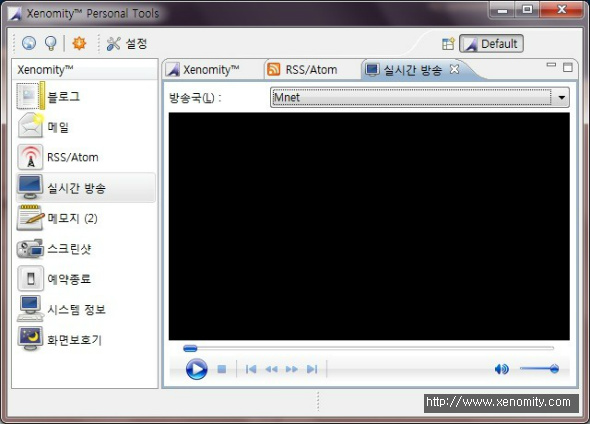

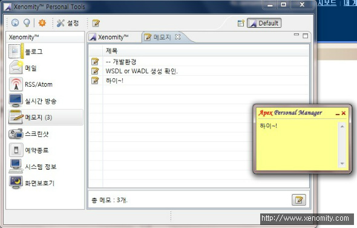

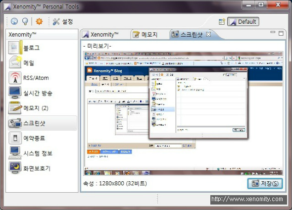

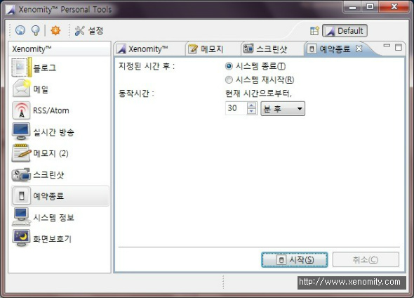

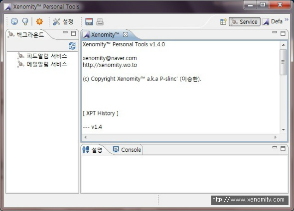

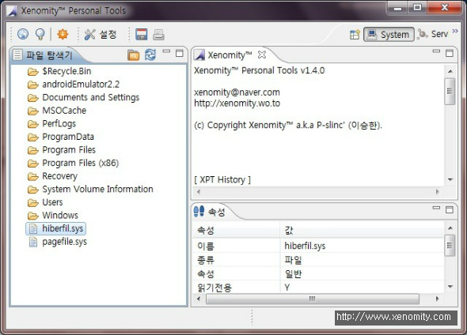

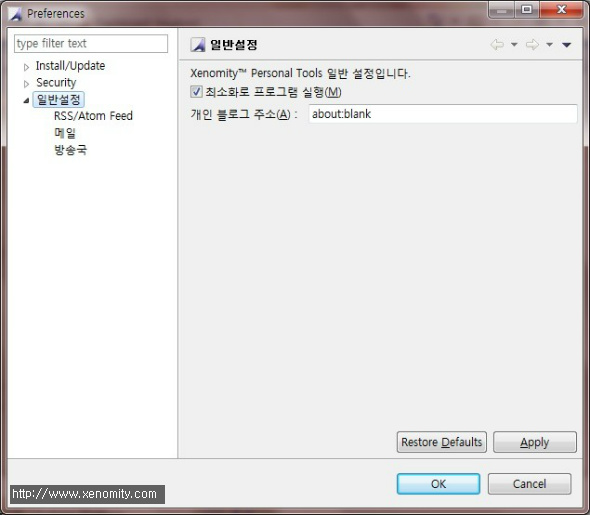

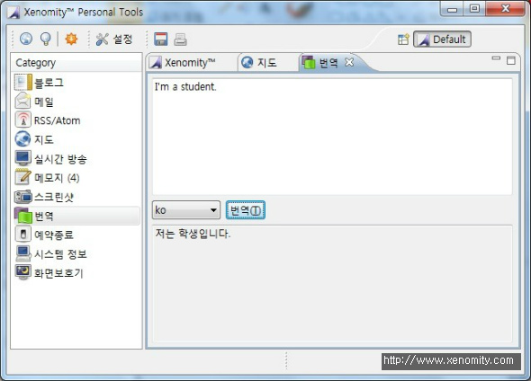
