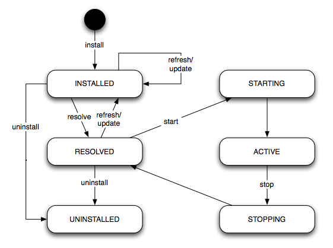

  
| Status | Description |
|--------|-------------|
| **INSTALLED** | 최초 번들이 설치된 상태 |
| **RESOLVED** | 번들의 검증이 정상적으로 수행된 상태 |
| **STARTING** | 번들이 서비스 레지스트리에 등록되고 시작중인 상태 |
| **ACTIVE** | 번들이 서비스 가능하게 활성화된 상태 |
| **STOPPING** | 번들이 중지중인 상태 |
| **UNINSTALLED** | 번들이 제거된 상태 |

  
