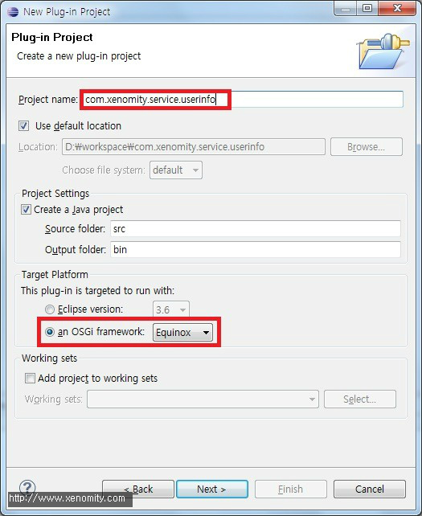
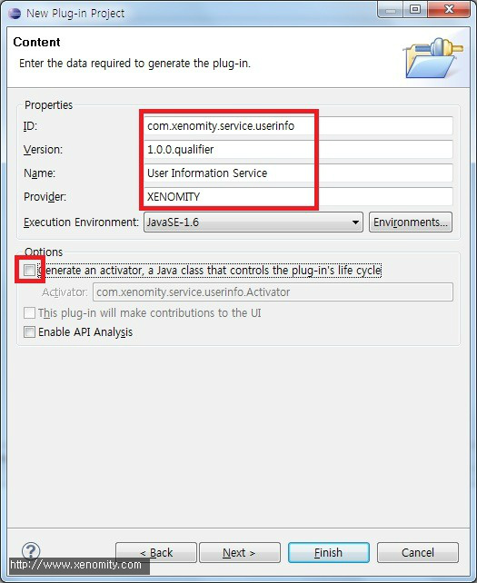
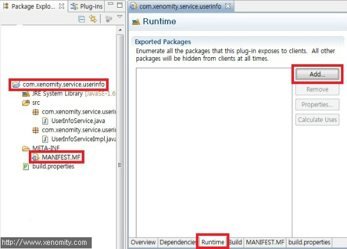
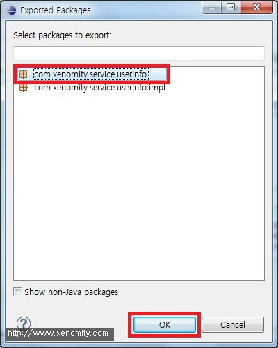
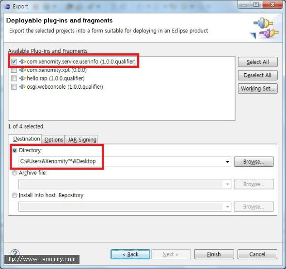
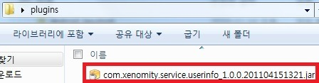

Spring DM에서 간단한 서비스 구현 및 배포의 예를 작성해 보았다.  
Spring DM Target Platform이 구성되어 있지 않은 경우, [이전 포스팅](http://blog.xenomity.com/Maven%EC%9D%84-%ED%86%B5%ED%95%9C-SpringDM-Target-Platform-%EC%83%9D%EC%84%B1)을 참고.  
  
- 작업환경  
  - Equinox Framework v3.4  
  - Spring 2.5.6a  
  - Spring DM v1.2.0

## 1. Project 생성
사용자 정보를 제공하는 서비스를 제공한다는 가정하에, 패키징 및 이식가능한 이 서비스의 독립적 모듈을 생성한다. 각 모듈은 각 프로젝트에 해당된다.  
  
New -> Plug-in Project  




  
  

## 2. 서비스 코드 작성
예) Service Interface  
```java
package com.xenomity.service.userinfo;
 
/**
 * User Information Service Interface
 */
public interface UserInfoService {
 
    /**
     * 관리자 이름 조회
     */
    String getAdministratorName();
 
    /**
     * 관리자 메일주소 조회
     */
    String getAdministratorEmail();
 
}
```
  
예) Service Implementation  
```java
package com.xenomity.service.userinfo.impl;
 
import com.xenomity.service.userinfo.UserInfoService;
 
/**
 * User Information Service Implementation
 */
public class UserInfoServiceImpl implements UserInfoService {
 
    public String getAdministratorName() {
        return "홍길동";
    }
 
    public String getAdministratorEmail() {
        return "aaa#bb.com";
    }
}
```
  
  
## 3. OSGi 서비스 구성
해당 서비스를 외부 번들에서 활용 가능하도록 MANIFEST.MF를 수정하여 패키지를 노출시킨다.  
MANIFEST.MF -> Runtime Tab -> Add  


  
서비스 인터페이스가 포함되어 있는 패키지를 선택한다.  


  
MANIFEST.MF의 내용을 보면 export-package로 해당 서비스의 인터페이스 패키지가 추가된 것을 확인할 수 있다.  
  
예) META-INF/MANIFEST.MF  
```
Manifest-Version: 1.0  
Bundle-ManifestVersion: 2  
Bundle-Name: User Information Service  
Bundle-SymbolicName: com.xenomity.service.userinfo  
Bundle-Version: 1.0.0.qualifier  
Bundle-Vendor: XENOMITY  
Bundle-RequiredExecutionEnvironment: JavaSE-1.6  
Export-Package: com.xenomity.service.userinfo
```
  

## 4. Spring DM 구성
Spring DM Extender를 통해 Spring Application Context 설정을 로딩하도록 디폴트 경로를 생성한다. Extender는 디폴트 경로로 META-INF/spring 하위에서 Spring 설정 파일들을 검색한다.  
  
폴더를 생성한 후, userinfo 서비스 구성을 위한 userinfoservice.xml을 생성하고 아래와 같이 Spring Bean으로 등록한다.  
  
예) META-INF/spring/userinfoservice.xml  
```xml
<?xml version="1.0" encoding="UTF-8"?>
<beans xmlns="http://www.springframework.org/schema/beans"
    xmlns:xsi="http://www.w3.org/2001/XMLSchema-instance"
    xsi:schemaLocation="http://www.springframework.org/schema/beans
        http://www.springframework.org/schema/beans/spring-beans.xsd">
 
    <bean name="userInfoService"
        class="com.xenomity.service.userinfo.impl.UserInfoServiceImpl" />
 
</beans>
```

  
그리고 해당 스프링 서비스를 OSGi 서비스로 발행하기 위한 osgi-userinfoservice.xml를 동일 경로에 작성한다.  
  
예) META-INF/spring/osgi-userinfoservice.xml  
```xml
<?xml version="1.0" encoding="UTF-8"?>
<beans xmlns="http://www.springframework.org/schema/beans"
    xmlns:xsi="http://www.w3.org/2001/XMLSchema-instance"
    xmlns:osgi="http://www.springframework.org/schema/osgi"
    xsi:schemaLocation="http://www.springframework.org/schema/beans
        http://www.springframework.org/schema/beans/spring-beans.xsd
        http://www.springframework.org/schema/osgi
        http://www.springframework.org/schema/osgi/spring-osgi.xsd">
 
    <osgi:service id="osgiUserInfoService" ref="userInfoService"
        interface="com.xenomity.service.userinfo.UserInfoService" />
</beans>
```
  

## 5. Test & Deploy
Eclipse PDE에서 자동으로 해당 번들을 지정된 Target Platform으로 포함시킬 것이다.  
Run as -> OSGi Framework를 통해 Console에서 해당 번들이 정상적으로 Install되고, 서비스 준비 가능한 상태인지 확인한다.  
  
예) OSGi Console  
```
osgi\> ss  
  
Framework is launched.  
  
id State Bundle  
0 ACTIVE org.eclipse.osgi_3.4.2.R34x_v20080826-1230  
1 ACTIVE org.eclipse.osgi.services_3.1.200.v20070605  
2 ACTIVE com.springsource.javax.servlet_2.5.0  
3 ACTIVE com.xenomity.service.userinfo_1.0.0.qualifier
```
  
테스트가 정상적이라면, 해당 번들을 배포가능한 형태로 패키징할 수 있다.  
  
Export -> Deployable plug-ins and fragments  


  
선택한 경로의 plugins 경로 아래로 해당 번들이 export된 것을 확인할 수 있다.  



