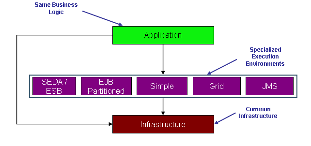
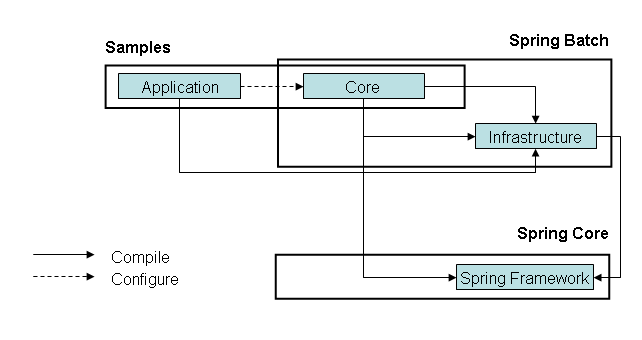

Spring Batch는 엔터프라이즈 환경에서의 작업을 위한 강력한 일괄 처리 응용프로그램 개발이 가능하도록 설계된 경량/포괄적 프레임워크로써, 로깅/추적, 트랜잭션 관리, 작업 처리 통계, 작업 다시 시작, 건너뛰기, 및 리소스 관리를 포함하는 레코드 처리에 필수적인 재사용 가능한 기능을 제공한다. 또한 파티션 기술과 최적화에 의한 고성능 배치 작업을 가능하게 하는 다양한 고급 서비스들을 지원하며, 단순하거나 복잡한 대용량의 배치도 확장성 높게 처리할 수 있다.

- SpringSource.org에서 발췌
  

Spring Batch는 low-level 형태로 Infrastructure 계층을 제공한다. 행 환경은 배치주기의 추적 및 관리를 위한 강력한 기능을 제공한다. 주요 목표는 배치 프로세스의 관리(작업 시작, 스케줄링, 다시 시작, 그리고 마지막으로 만들어진 결과 처리)가 개발자를 위해 손쉽게 가능해야 한다는 것이다.  
Infrastructure는 작업을 일괄 처리하며, 예외가 발생한 경우에는 다시 시도하는 기능을 제공한다. 그리고 Core 모듈은 작업 처리 통계, 작업 시작 및 전체 수명 주기를 관리하며 다시 시작을 포함하는 통합 기능의 강력한 세트를 제공하는 배치에 초점을 맞춘 Domain이며 또한 구현체이다.  
  
Infrastructure와 Core의 실행단계에서 의존성은 다음과 같다.  

- SpringSource.org에서 발췌

