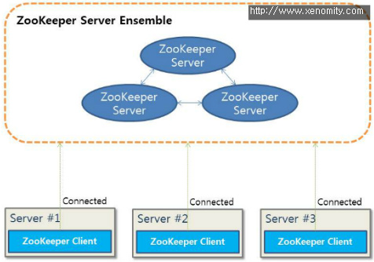
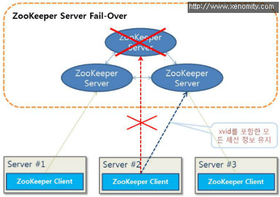
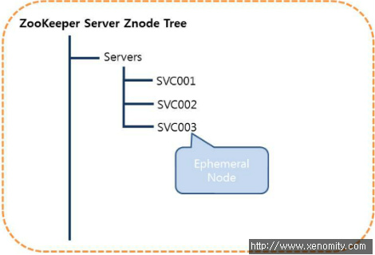
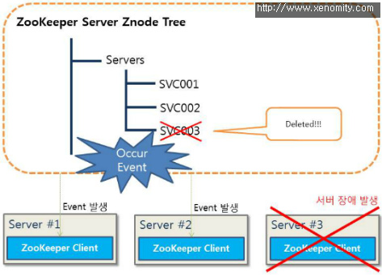
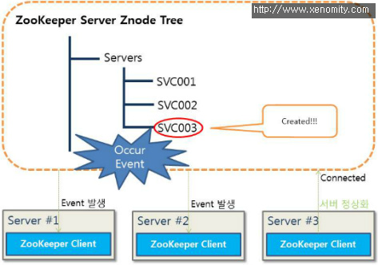

ZooKeeper는 분산 코디네이터로 application level의 고가용성(H/A) 구현을 용이하게 한다.

예로 ephemeral znode를 적절히 응용하면 load balancing, fail-over도 이벤트 핸들링 방식으로 손쉽게 구현할 수 있다. 실제로 Hadoop의 분산 서버 관리 프로세스도 ZooKeeper의 ephemeral znode로 서버 상태를 관찰(watch)한다.

- Apache ZooKeeper에 대한 개념은 [이전 포스팅](https://blog.xenomity.com/Apache-ZooKeeper-1-Overview)을 참고.

이번에는 ZooKeeper를 통한 간단한 장애 통지 프로세스의 예를 작성해 보았다.
 

## 1. Scenario
다음과 같은 환경이 구성되어 있다고 가정한다.



앙상블 구성은 ZooKeeper Client의 Fail-over를 위한 최소 조건으로 3대를 구성하고, 각각의 운영 서버에는 ZooKeeper Client가 구현되어 있다.

(* 서버 앙상블은 리더 선출을 위한 홀수개의 서버로 구성되며, 짝수로 구성할 경우 정상 동작하지 않는다.)



ZooKeeper Client는 최초에 자신의 서버 정보를 ZooKeeper Server의 특정 노드 아래 임시 노드(ephemeral znode)로 등록하고, 특정 노드를 감시(watch)하며 변경사항을 모니터링한다. 임시 노드로 등록된 정보는 해당 클라이언트와 연결이 끊어지면, ZooKeeper Server 노드상에서 자동으로 제거되므로 ZooKeeper Client는 노드 변경 이벤트를 받으면 장애 후처리 프로세스로 처리를 위임하는 역할을 하게 된다.





그리고 장애 서버가 정상화되면, 장애 복구에 대한 후처리도 생각해 볼 수 있다.



이 시나리오를 토대로 진행한다.
 

## 2. Ensemble 서버 구성
앙상블로 클러스터링할 ZooKeeper Server군은 zoo.cfg 파일에 앙상블 구성을 한다.

예 1) zoo.cfg
```
...

dataDir=./data    // ZooKeeper Server Data Path  
clientPort=2181   // Client Connection Port**

# Ensemble Configurations
server.1=192.168.0.1:2888:3888  
server.2=192.168.0.2:2888:3888
server.3=192.168.0.3:2888:3888
```
- Usage: `server.{myid}={serverIp}:{quorumPort};{readerElectionPort}`

그리고 zoo.cfg에 정의된 `dataPath`의 경로에 `myid` 파일을 각 서버별로 직접 생성하여 준다. 서버별 myid 파일에 들어가는 내용은 zoo.cfg에서 정의한 `server.{myid}` 부분의 `myid`이다.

예 2) vi myid
```
2
```
 

## 3. ZooKeeper Server 시작
각 서버의 ZooKeeper Server가 설치된 경로의 bin에서 다음 스크립트를 실행한다.

`./zkServer.sh start`

서버가 시작되면 해당 경로에 zookeeper.out이라는 로그 파일이 생성된다.
 

## 4. ZooKeeper Client 개발
시나리오 상에서 ZooKeeper Client는 자기 자신의 서버 정보 등록을 위해 서버 기동 시점에 ZooKeeper Server로의 연결 및 서버 셧다운 시점의 연결 종료, 그리고 서버 상태 변경 이벤트를 수신하고 장애/복구 처리 프로세스로 위임하는 크게 2가지 역할을 하게 된다. 먼저 ZooKeeper Client Library를 dependency로 추가한다. 현재일자 기준으로 최신버전은 3.4.4(stable)이다.

예 4) Maven POM
```xml
<dependency>
    <groupId>org.apache.zookeeper</groupId>
    <artifactId>zookeeper</artifactId>
    <version>3.4.4</version>
</dependency>
```

그리고 서버 기동/종료시에 ZooKeeper Server로의 연결/해제 코드를 작성한다. JEE 환경이라면 Front Controller로 정의된 서블릿의 init(), destroy()도 좋고, IoC Container나 프레임워크를 사용한다면 서버의 생명 주기와 같은 Singletone 객체의 postConstruct, preDestroy 단계에 적용해도 좋아보인다. ZooKeeper Client의 인스턴스를 편하게 공유하려면 ZooKeeper에 대한 Factory 클래스를 정의하는 것도 좋은 방법이다.

예 5) 서버 ID를 임시 노드로 등록
```java
zooKeeper.create("/servers/svc001", null, Ids.OPEN_ACL_UNSAFE, CreateMode.EPHEMERAL);
```

위 코드는 ZooKeeper Server에 '/servers'라는 영속 노드가 존재함을 가정하고, 정상적인 연결이 이루어지면 바로 자기 자신의 서버 정보(여기서는 서버 ID)를 임시 노드로 생성하는 부분을 보여준다. 임시 노드로 생성된 znode는 ZooKeeper Server와 Client의 연결이 종료되면, 자동으로 삭제된다.

(ZooKeeper는 각 노드별 깊이를 한번에 생성하거나 삭제할 수 없다. 위의 경우, '/servers' 노드가 이미 존재해야 하위에 노드를 추가할 수 있다.)

다음은 `/servers` 노드에 감시자(Watcher)를 설정하여 자식 노드의 변경에 대한 이벤트를 수신하고, 이벤트 종류에 따라 핸들링하는 예이다. 참고로 Watcher는 한번만 수행되므로, 요건이나 상황에 따라 Watcher를 지속적으로 재설정해야 할 수도 있다.

예 6) Event Handling
```java
zooKeeper.exists("/servers", new Watcher() {
 
    @Override
    public void process(WatchedEvent event) {
        if (event.getType() == Event.EventType.NodeChildrenChanged) {
            String serverPath = event.getPath();
 
            if (zooKeeper.exists(serverPath, false) != null) {
                // TODO 서버 복구 통지 및 처리
                // adminService.alive(serverPath);
            } else {
                // TODO 서버 장애 통지 및 처리
                // adminService.dead(serverPath);
            }
        }
    }
 
});
```

ps. 다음에는 분산 서버 환경에서의 Lock Service, Queuing에 대해 포스팅 해 볼 생각이다. ZooKeeper는 분산 환경에서의 락 서비스를 직접적으로 지원하지 않기에 동시성 보장을 위해서는 적절한 락 서비스를 구현해야 한다.

 

