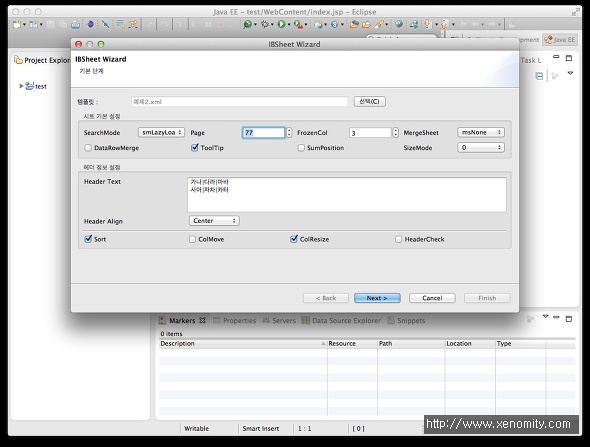
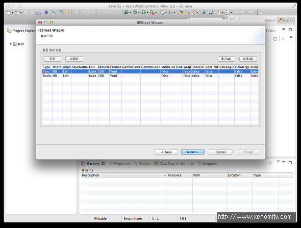
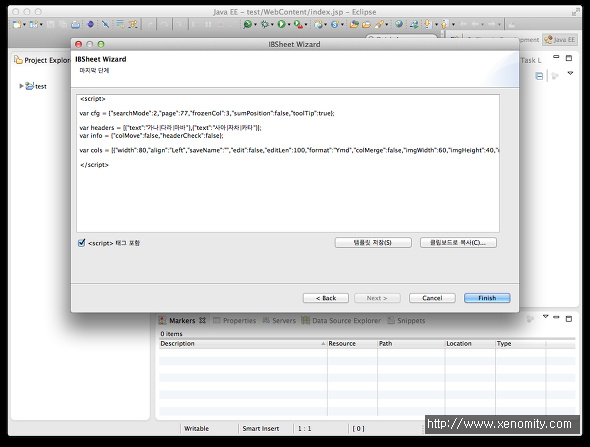
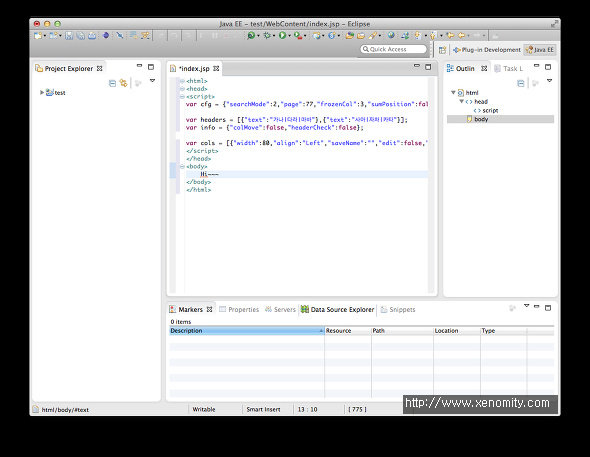

간만에 주말 아르바이트로 만들고있는 `IBSheet Code Generator  - Eclipse Plugin` 버전.

아직 관공서쪽에는 꽤 사용하고 있는 국산 X-Internet Tool로, 근래에는 Active-X/Silverlight 버전에서 HTML5 버전으로 업그레이드 될거라는 소문(?)도 있더라...

여하튼 IBSheet로 개발하시는 분들에게 노가다를 줄여 줄 수 있기를 바라며! -0-/

* Eclipse 3.4 Ganymede 이상 버전에서 사용 가능.

ps. 당분간 주말이 없겠군..;;

