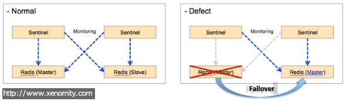

Redis Sentinel은 Redis 서버군을 관리하기 위한 목적으로 개발된 도구이다.

이전에는 Sentinel이라는 이름으로 비공식 배포되었다가, Redis 2.6 버전부터 정식 패키지에 포함되어 배포되기 시작했다. 아직은 beta release이지만, 실서비스에 도입해본 결과 failover나 master server election 등의 기능은 모두 무리없이 동작함을 확인하였다.

> Monitoring: Sentinel constantly check if your master and slave instances are working as expected.
> Notification: Sentinel can notify the system administrator, or another computer program, via an API, that something is wrong with one of the monitored Redis instances.
> Automatic failover: If a master is not working as expected, Sentinel can start a failover process where a slave is promoted to master, the other additional slaves are reconfigured to use the new master, and the applications using the Redis server informed about the new address to use when connecting.
- http://redis.io/topics/sentinel

Sentinel은 이미 동작하고 있는 Redis 서버군의 설정(Master/Slave 정보 등)을 기반으로 동작하기에, 좀 더 수월하게 관리할 수 있다. 이 말은, 'Redis==Sentinel'이기 때문이기도 하다. (실제로 Sentinel은 Redis의 다른 실행 모드이다. 컴파일된 바이너리의 사이즈를 비교해보면, redis-server와 redis-sentinel의 파일 사이즈가 정확하게 일치한다.)

다음은 간략한 센티널 구성의 예이다.



Redis Server와 Sentinel Server는 각 2대씩 구성되어 있다고 가정한다. 여기서 각 Sentinel 서버는 각각의 Redis instance를 모니터링하며, Redis master server 장애 감지시, 다른 Redis slave server 중 우선순위가 높은 서버를 Master server로 승격시키고 failover를 수행한다.

(Master election에 대해 최소 몇 개의 Sentinel 서버가 동의해야 failover를 수행할지 결정할 수 있다.)


## 그럼 Client Connection Failover는???
현재 Redis client library로 Jedis를 사용하고 있는데, API 레벨에서 connection failover를 지원하지 않는다;;; (현재일자 기준 Jedis 최신버전 2.1.0)

덕분에 지저분한 코드가 만들어지긴 했지만, Sentinel도 결국 Redis이므로 Sentinel 서버의 subscribe를 통해 `+switch-master` 메세지를 수신하면, 동적으로 Redis master server address와 connection pool을 갱신하는 방법으로 Jedis를 확장하여 구현했다;;;

```
mymaster 1.1.1.1 6379 1.1.1.2 6379
```

- `+switch-master` 수신 메세지의 예.

여기서 첫번째 address는 이전 Master address이며, 두번째 address가 실제 변경된 Master address이다. 클라이언트는 항상 Sentinel 방송 메세지를 watching하고, 해당 메세지가 수신되면 갱신된 Jedis instance를 반환해주는 Factory로 개발한다면 크게 복잡할건 없다..


## References
- Redis Sentinel Doc: [http://redis.io/topics/sentinel](http://redis.io/topics/sentinel)