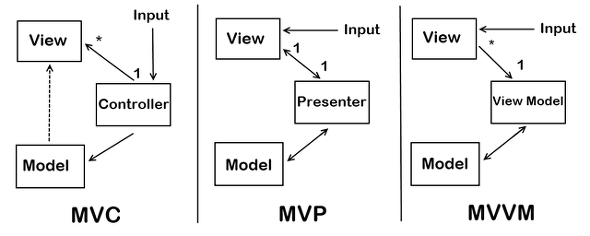
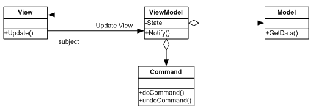

주말에 짬이 생겨 AngularJS를 훑어보고 있는데, MVW라는 재밌는 표현이 보이길래 잠시 정리해 보았다.

## MVW (Model View Whatever)란?
MVW란, 기존의 Presentation Pattern들 중 MVx에 해당하는 패턴을 포함(e.g, MVC, MVP, MVVM, etc) 또는 Model과 View 그리고 '무엇이든지' 올 수 있음을 의미하는 용어로 사용된다. 잠시 AngularJS 사이트의 내용을 빌려오자면,

> AngularJS - Superheroic JavaScript MVW Framework.
> AngularJS is what HTML would have been, had it been designed for building web-apps. Declarative templates with data-binding, MVW, MVVM, MVC, ...

- http://angularjs.org

그럼, MVW에 해당하는 MVC/MVP/MVVM 패턴에 대해 간단히 알아본다.

## MVC vs MVP vs MVVM
MVC에서 파생된 MVP/MVVM 패턴은 관심사의 분리(Separation of Concerns)를 통한 Model, View 사이의 coupling을 줄이고 기능 단위의 cohesion을 높이기 위한 관점으로 MVC와 목표하는 바가 같다. 이 목적을 위해 각 패턴은 View와 Model 사이의 상호 작용을 위한 component를 Controller/Presenter/ViewModel이라는 이름으로 표현하고 있다.

- MVC vs MVP vs MVVM

### MVP Pattern
MVP 패턴은 View와 Model간의 coupling을 완화하기 위해 일련의 workflow 제어 과정을 controller가 전부 담당하여 재사용성을 떨어뜨리는 MVC 패턴의 약점을 해결하기 위해 고안된 패턴이다. 사용자 입력 처리를 Controller가 처리하던 MVC와는 달리, View에 입력 이벤트가 발생하면 Presenter는 interface를 통해 전달받은 input data를 토대로 business service로 처리를 위임하고 변경된 Model로 View를 갱신한다.

(* 보통 Observer 패턴을 통해 설계되며, Model은 Presenter로 변경 내역을 통지-notify-한다)

그러므로 View가 Model의 참조를 통해 갱신되는 MVC와는 다르게, MVP는 Presenter라는 중계자(Mediator)를 통해 View와 Model간의 느슨한 결합을 가능하게 한다.
(* Presenter가 View를 갱신하므로, 둘은 1:1 관계가 된다.)

| MVC | MVVM |
|-|-|
|  |  |

- Sequence Diagram: MVC (Model 2) vs MVP

### MVVM Pattern
MVVM 패턴은 Microsoft WPF(Windows Presentation Framework)에서 대표적으로 찾아볼 수 있는 프리젠테이션 패턴으로, Data-Binding 방식을 통한 View와 Model간의 원천적인 코드 분리를 목적으로 한다. MVP에서 Presenter가 Model의 변화에 따라 View를 갱신하는 중계자 역할로서 View와 Model 사이의 loose-coupling을 지향했다면, MVVM의 ViewModel은 View의 속성을 ViewModel에 바인딩하여 ViewModel이 View를 갱신하는 코드가 불필요해지고, 따라서 ViewModel의 재사용성이 높아지고 단위 테스트도 훨씬 수월해진다는 장점이 있다.

여기서 ViewModel에 대해 좀 더 짚고가자면, 이름에서 봐도 알 수 있듯이 ViewModel은 View를 속성을 관리하기 위한 'Wrapper-Model'이라고 볼 수 있다. 연관된 여러 View들의 속성이 변경되면 하나의 ViewModel 속성이 data-binding에 의해 함께 변경되므로, View와 ViewModel은 n:1의 관계를 가질 수 있다. 이러한 특성으로 ViewModel은 View에 대한 참조를 제거하고, 데이터의 상호 흐름을 감출 수 있다.

(* MVVM 패턴은 MVB(Model-View-Binder) 패턴으로 호칭되기도 한다.) 

- MVVM Class Diagram

## References
- MVP: Model-View-Presenter: The Taligent Programming Model for C++ and Java (1996) by Mike Potel: [http://www.wildcrest.com/Potel/Portfolio/mvp.pdf](http://www.wildcrest.com/Potel/Portfolio/mvp.pdf)
- WPF Apps With the Model-View-ViewModel Design Pattern (2009) by Josh Smith: [http://msdn.microsoft.com/en-us/magazine/dd419663.aspx](http://msdn.microsoft.com/en-us/magazine/dd419663.aspx)

