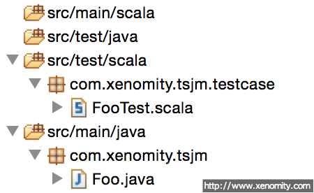

## Problem
복잡한 비지니스 로직을 포함하는 자바 프로젝트는 그 테스트도 상당히 복잡해진다. 다양한 조건과 분기 테스트를 수행하는 단위 테스트 케이스는 코드도 길어지고 본래 테스트의 의미를 제대로 표현하지 못하는 지저분한 코드가 되기 쉽상인데, 이런 상황에서 테스트 케이스만 다른 언어로 적용하는 것도 어느 정도 관리 효율성 및 코드 품질을 높일 수 있는 방법이 된다.  
테스트 케이스용 언어 선별은 우선적으로 **JVM 위에서 동작하는 동적 타입 언어**들을 대상으로 볼 수 있는데, 그 이유는 아무래도 개발 및 런타임 환경을 기존대로 유지하기가 쉽고 Java Package를 재사용할 수 있으며 트렌디한 동적 언어들의 간결한 문법이 테스트 케이스의 부수 코드를 줄이고 읽기 쉽게 코딩하는데 도움을 줄 수 있기 때문이다.  
(* JVM 지원 언어: [Wiki 참고](http://ko.wikipedia.org/wiki/%EC%9E%90%EB%B0%94_%EA%B0%80%EC%83%81_%EB%A8%B8%EC%8B%A0_%EC%A7%80%EC%9B%90_%EC%96%B8%EC%96%B4))  
여기서는 자바와 호환성이 좋은 스칼라를 다룬다.

## Forces
테스트 패키지를 이종 언어로 개발하는 경우, 다음 사항들을 준수해야 한다.

- 기존 개발 프로세스에 영향을 끼치지 않아야 한다.
- 기존 개발 표준(eg. application architecture, development pattern, etc.)에서 벗어나지 않아야 한다.
- 원 언어로 개발했을 때보다 케이스 관리가 용이해야 한다.

## Solution
Maven Project 구성을 예로 설명한다.

### 1. Add Maven Dependency
Maven POM에 스칼라 라이브러리 의존성을 추가한다. 현재 일자 기준 최신 버전은 2.11.6이다.

```xml
<dependency>
	<groupId>org.scala-lang</groupId>
	<artifactId>scala-library</artifactId>
	<version>2.11.6</version>
</dependency>
```

### 2. Add Maven Plugin
비슷한 이름의 `maven-scala-plugin`이 존재하나 이미 2010년 마지막 릴리즈 이후로 업데이트가 없으므로 최신 버전의 `scala-maven-plugin`을 사용한다. 기존에 구성된 POM에 아래 예제와 같이 해당 플러그인과 실행 목표를 추가 정의한다. 현재 일자 기준 최신 버전은 3.2.0이다.

```xml
<build>
	<pluginManagement>
		<plugins>
			<plugin>
				<groupId>net.alchim31.maven</groupId>
				<artifactId>scala-maven-plugin</artifactId>
				<version>3.2.0</version>
			</plugin>

				...

		</plugins>
	</pluginManagement>
	<plugins>
		<plugin>
			<groupId>net.alchim31.maven</groupId>
			<artifactId>scala-maven-plugin</artifactId>
			<executions>
				<execution>
					<id>scala-compile-first</id>
					<phase>process-resources</phase>
					<goals>
						<goal>add-source</goal>
						<goal>compile</goal>
					</goals>
				</execution>
				<execution>
					<id>scala-test-compile</id>
					<phase>process-test-resources</phase>
					<goals>
						<goal>testCompile</goal>
					</goals>
				</execution>
			</executions>
		</plugin>

			...

	</plugins>
</build>

...
```
`scala-maven-plugin`의 자세한 내용은 [공식 Github](http://davidb.github.io/scala-maven-plugin/plugin-info.html) 링크를 참고한다.

### 3. Test by JUnit 4
다음과 같은 위치에 각각 샘플 코드를 작성했다고 가정한다. `src/test/scala` 패키지의 `FooTest.scala` 파일은 `src/main/java` 패키지의 `Foo.java` 클래스를 단위 테스트한다.

- 그림 1. Maven Project Structure

아래 예는 Spring-based 환경에서 `SpringJUnit4ClassRunner`를 통한 JUnit 샘플이다. 임의의 Maven Goal을 실행해보면, Test Goal에서 정상적으로 실행됨을 확인할 수 있다.

```java
@RunWith(classOf[SpringJUnit4ClassRunner])
@Transactional
@ContextConfiguration(Array("classpath:/config/spring/applicationContext.xml"))
class FooTest {
	@Autowired
	private var foo: Foo = null

	@Test
	def testFoo() {
		Assert.assertEquals("Foo", foo.getName)
	}
}
```

```
 T E S T S

Running com.xenomity.tsjm.testcase.FooTest
Tests run: 1, Failures: 0, Errors: 0, Skipped: 0, Time elapsed: 0.044 sec

Results :

Tests run: 1, Failures: 0, Errors: 0, Skipped: 0

[INFO] --- maven-jar-plugin:2.4:jar (default-jar) @ test-scala-java-mixed ---
[INFO] Building jar: /Users/Xenomity/Documents/workspace/test-scala-java-mixed/target/test-scala-java-mixed-0.0.1-SNAPSHOT.jar
[INFO]
[INFO] BUILD SUCCESS
[INFO]
[INFO] Total time: 3.984 s
```

### 4. 기타
Maven이 아닌 로컬 개발 환경에서 직접 빌드 및 테스트를 하고자 할 경우, 이클립스 IDE를 사용하고 있다면 구성된 프로젝트에 `Scala Nature`를 추가해야 한다. 이클립스의 기본 템플릿 프로젝트는 Java와 Scala의 혼합형 템플릿을 제공하지 않기 때문에 별도의 작업이 필요하다. 일단 `Scala Nature`를 로컬 프로젝트에 추가하기 위해서는 [Scala IDE for Eclipse](http://scala-ide.org/) 번들이 사전 설치되어 있어야 한다.  
(* Scala IDE는 RCP/Plugin 버전 둘 다 제공한다.)

```xml
<projectDescription>
	<name>test-scala-java-mixed</name>
	<buildSpec>
		<buildCommand>
			<name>org.scala-ide.sdt.core.scalabuilder</name>
		</buildCommand>

		...

	</buildSpec>
	<natures>
		<nature>org.scala-ide.sdt.core.scalanature</nature>

		...

	</natures>
</projectDescription>
```
`Scala Nature`를 추가하면 해당 프로젝트에서 Scala 파일 생성 및 빌드가 정상적으로 이루어진다.

