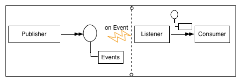

## EDA 개념
EDA(_Event Driven Architecture_)는 -**이벤트의 생산, 감지, 소모 그리고 반응을 위한 소프트웨어 설계 패턴**-이다. 이미 꽤 오래전에 나온 디자인이고 GUI를 다루는 Rich Client 분야에서 쉽게 볼 수 있었지만, 몇 해 전부터 유행하기 시작한 실시간 분석 기술들이나 SOA 2.0과 함께 엔터프라이즈 설계 패턴으로 재조명받고 있는 듯 하다.

EDA의 특징은 다음과 같다.
- Asynchronous Processing.
- Reaction System.
- Pre-processing and Post-storing.
- Event Concerned.

애플리케이션 관점에서 EDA는 비동기 이벤트 전달/처리에 따라 이벤트에 빠르게 반응할 수 있도록 도와주고, 도메인 모델과 별개로 '이벤트 모델'에 집중할 수 있는 개발 패턴을 강제한다. 여기서 이벤트란, '과거 정보로부터 발생하는 상태의 변화' 정도로 설명할 수 있는데, [Esper](http://www.espertech.com) 사이트에 잘 정의되어 있길래 인용한다.
> An event is and immutable record of a past occurrence of an action or state change.
> Event properties capture the state information for an event.

그리고 정보의 빠른 분석을 위한 선-처리/후-저장 패러다임은 실시간(real-time) 분석 시스템과 잘 어울리기도 하다.

## EDA Design
EDA의 핵심 요소는 Event Generator와 Event Channel, Event Processing Engine이다. 이벤트는 Event Generator에 의해 생성되고 이벤트는 Event Channel을 통해 발행되며, Event Processing Engine에 의해 소비된다. 이벤트의 발행과 소비는 일반적인 MOM(_Message-oriented middleware_)의 특징(Pub/Sub based non-bloking)을 그대로 차용하고 있다.

  

- 그림 1. EDA Event Channel

위 그림만 보면 일반적인 MOM과 거의 흡사해 보인다. 하지만 대다수의 EDA 기반 플랫폼들은 이벤트 필터링을 위한 독자적인 규칙(Rule or Policy, Pattern) 처리 엔진을 포함한다. 메세지의 발행이 요청에 따라 발생하는 것과 달리, 규칙 처리 엔진에 의해 이벤트화되어 발생되는 것이 차이점이다.

이런 이유로 EDA는 SOA와도 상호 보완적인데, SOA의 동기적인 서비스 호출 구조와 순차적 제어 구조는 EDA 특성과 맞물려 좀 더 느슨한 연결을 이루고 유연성과 확장성을 높일 수 있다. 실제로 'SOA 2.0'을 간단하게는 SOA + EDA 설계 패턴으로 볼 수 있는데, 이를 'Event-driven SOA'라고 부르는 이유이기도 하다.

## Event Processing Style
EDA 애플리케이션에서 이벤트를 처리하는 대표적인 방식은 아래와 같다.

- **SEP(_Simple Event Processing_)**
  - 단순 이벤트 발생에 따른 정보 전달에 초점을 둠.
- **ESP(_Event Stream Processing_)**
  - 단순 정보 흐름에 따른 이벤트의 변화를 빠른 속도로 분석하고 질의하기 위한 방법에 초점을 둠.
  - SEP + Continuous Query.
- **CEP(_Complex Event Processing_)**
  - 다중 정보 흐름에 따른 이벤트의 변화를 감지하고 패턴과 연관 관계를 추론하는 방법에 초점을 둠.
  - SEP + Pattern Detection, Pattern Correlation.

ESP는 마켓 데이터 분석과 같은 지속적인 질의/분석이 필요한 곳에 주로 활용되었고, CEP는 여러 분산된 환경에서 무작위로 발생하는 이벤트 구름으로부터 특정 패턴을 구하는 목적(_e.g. Business Activity Monitoring_)으로 활용되었다고 한다. 하지만 근래에는 경계가 거의 모호하고 일반적인 CEP 솔루션들은 ESP 처리 엔진도 포함하고 있다. 요구 사항에 따라 선택할 수 있는 폭이 넓어졌다. 대표적인 ESP/CEP 오픈 소스로는 [Apache Storm](http://storm.apache.org), [Esper](http://www.espertech.com) 등이 있다.

## References
- Event-driven architecture: [https://en.wikipedia.org/wiki/Event-driven_architecture](https://en.wikipedia.org/wiki/Event-driven_architecture)
- Event-driven SOA: [https://en.wikipedia.org/wiki/Event-driven_SOA](https://en.wikipedia.org/wiki/Event-driven_SOA)
- Event stream processing: [https://en.wikipedia.org/wiki/Event_stream_processing](https://en.wikipedia.org/wiki/Event_stream_processing)
- Complex event processing: [https://en.wikipedia.org/wiki/Complex_event_processing](https://en.wikipedia.org/wiki/Complex_event_processing)
