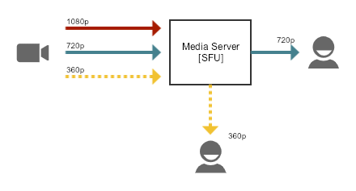
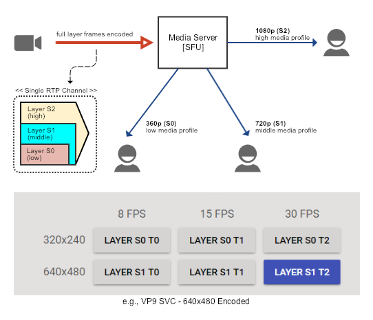

## Problem
대부분의 1 세대 WebRTC SFU 서버는 서로 다른 참가자에게 독립적으로 미디어 비트율을 적용 할 수 없었다. SFU 서버는 모든 수신자의 RTCP feedback을 송신자에게 전달하므로, 결국 송신자는 최악의 수신자 조건 (*e.g., 가장 낮은 예상 대역폭 및 최악의 네트워크 QoS*)에 따른 미디어 비트율을 적용하고 모든 수신자에게 전달하게 되므로 결국 전체적인 미디어 송신 품질을 떨어뜨리게 된다. 이러한 문제를 해결하기 위해 WebRTC 미디어 서버들은 몇 가지 표준적인 기술 구현을 제공한다.

## Simulcast vs SVC
수신자 별 원하는 미디어 프로필로 시청 가능하도록, 동시 방송(simulcast)과 확장 가능한 비디오 코딩(SVC) 방식의 적용을 고려해 볼 수 있다.

### Simulcast

- 송신측에서 여러 미디어 프로필로 동시 방송을 시작하면, 클라이언트는 적절한 미디어 프로필을 선택하여 시청할 수 있다.
- 단일 스트림 방송보다 대역폭과 자원을 많이 낭비하지만, 클라이언트는 환경에 순응적인 시청 정책을 결정할 수 있다.
- 단, 클라이언트가 네트워크 대역폭이나 자원 이용률에 따라 적응형 미디어 프로필로 시청할 수 있도록 하려면, RTCP REMB 교환 등의 방법을 통해 지능적인 media switching machanism이 고려되어야 한다. 
- 현재 일자 기준 VP8/9, H264 코덱 지원.

### SVC(Scalable Video Coding)

- 계층적(시간, 공간, 품질)으로 미디어 프로필을 인코딩하고, 단일 RTP 프레임으로 전송할 수 있는 코덱 기술.
- SFU는 클라이언트 RTCP feedback을 기준으로, 미디어 프레임의 계층을 선택하여 전송할 수 있다.
- 현재 일자 기준 VP9 코덱 지원.
- vs Simulcast,
  - SVC의 경우, 상위 계층 프레임은 하위 계층 프레임을 포함하고 있고 각 슈퍼 프레임은 SFU가 개별 레이어 프레임을 추출 할 수 있도록 RTP 확장 패킷(i.e., rtp extension header)에 여분의 payload 설명과 함께 단일 RTP 프레임으로 전송.
  - 그러므로, 여러 미디어 프로필로 동시 방송을 하는 방식인 simulcast에 비해 대역폭 소비 및 클라이언트 CPU 인코딩 비용을 최소화할 수 있고, 좀 더 경량의 비디오 라우팅 아키텍처를 제공할 수 있다.

## Conclusion
대부분의 WebRTC SFU 서버들은 VP8 동시 방송을 지원하지만, 최종적으로 적응형 스트리밍은 플랫폼 별 코덱 불일치 문제와 상관없이 SVC로 서비스함을 목표로 해야 할 필요가 있다.

## References
- [VP9 SVC](https://webrtchacks.com/chrome-vp9-svc/)
