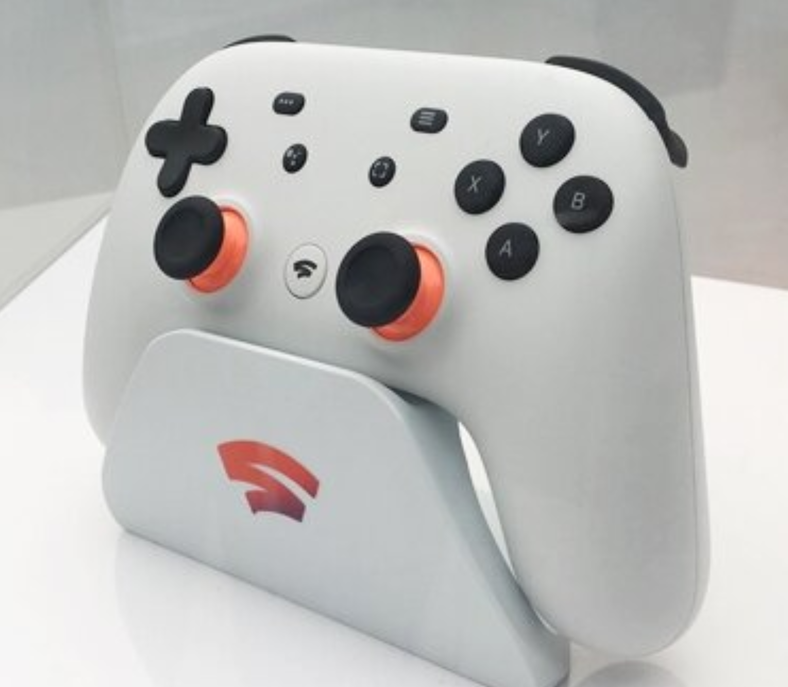
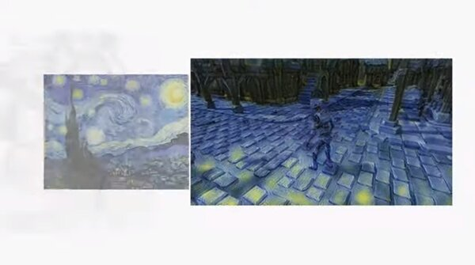
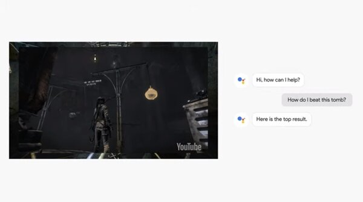
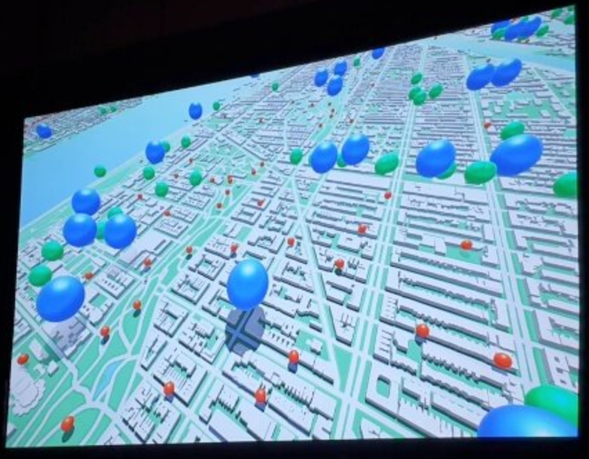
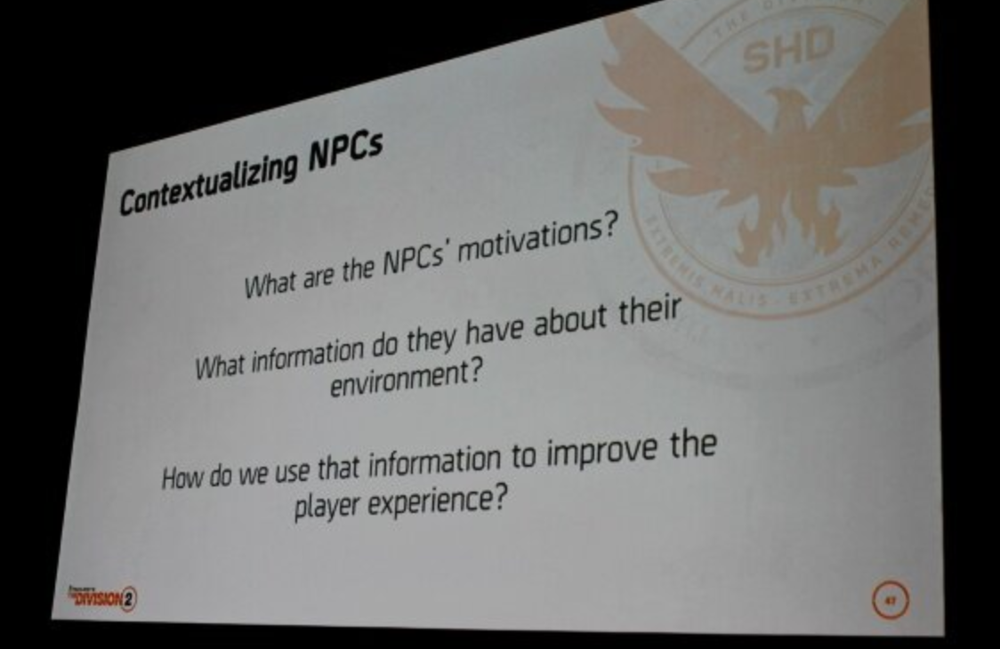

## 'SLAY THE SPIRE': METRICS DRIVEN DESIGN AND BALANCE
스팀 사용자 평가 99% 이상의 호평받은 인디 게임으로, 효과적인 게임 마케팅 방법과 과정에 대한 내용 공유.

1. 인터넷을 통한 새로운 채널의 파급력이 게임 마케팅에 있어서 중요한 변화를 가져올 수 있다는 점에 주목.
    - 소셜 네트워크 및 메일링 리스트를 통한 게임 홍보.
    - 개발 블로그를 통한 관심사 유도.
    - Key-mailer([https://www.keymailer.co](https://www.keymailer.co))에 게임을 업로드하여 Streamer, YouTube Creator들을 자연스럽게 마케팅에 참여시킴.
2. 게임 페스티벌 현장에 지속적으로 참가하고 즉각적인 피드백 취합.
3. 패치, 업데이트 내용은 스토어나 소셜 네트워크를 통해 주기적으로 공지.
4. 유저의 피드백을 즉각적으로 확인할 수 있도록 자체 bot 개발.
5. 각국의 언어로 로컬라이징을 진행하는 것도 자연스러운 마케팅 수단.
    - 특히, 한국, 일본, 러시아 등 언어 추가가 이루어지고 나서야 각국의 점유율이 상승.

지금 세상은 -**개발자들이 직접 게임을 알릴 가능성**-이 열려있는 시대. 소셜 미디어의 등장과 개발자 스스로 게임을 홍보하는 채널이 생겼다는 것, 이 모든 것이 새로운 시장성이며 기회가 될 수 있다는 점이 작은 규모의 게임에 기회가 될 수 있음을 시사.

## 'STADIA': GOOGLE PROJECT STREAM
신규 클라우드 게임 콘솔 서비스 **STADIA** 공개.

- '언제 어디서나 어떤 기기에서든' 게임을 즐길 수 있는 클라우드 기반의 게임 스트리밍 서비스.
    - Vulkan 기반의 게임 빌드를 STADIA 클라우드 서버에서 구동하고, 유저는 전용 클라이언트 또는 브라우저에서 원격 플레이.
- 게임 출판을 위한 게임 플랫폼인 '**GGP(Google Gaming Platform)**' 제공.
- 게임 개발을 위한 크로스 플랫폼용 '**GGP SDK**' 빌드 도구 지원.
- STADIA 서버의 GPU는 AMD와의 협력에서 탄생한 커스텀 칩셋을 사용.
    
    - 10.7 테라 플롭스의 처리 능력을 갖췄으며, 이는 Xbox One X의 1.5배, PS4 프로와는 2배 이상 차이가 나는 성능.
- QUIC + improved WebRTC 기반의 초 저-지연 스트리밍 제공.
    - 1080p@60hz 기준 200ms 미만의 레이턴시 목표.
    - 크롬의 WebRTC 구현체도 STADIA 요구사항에 발맞춰 적합하게 수용될 수 있도록 최적화될 것.
    - 시연 영상: [Doom](https://www.youtube.com/watch?v=y-tgUx6lD4Y)
- 게이머와 시청자, 크리에이터, 그리고 개발자를 하나로 묶기 위한 시도.
    - 유튜브를 중심으로 한 연계 커뮤니티 형성을 목표.
    - 전용 컨트롤러 생산.
    
        - '공유' 버튼을 통해 내 플레이를 유튜브로 라이브 스트리밍하거나, '도움' 버튼을 통한 개인화 서비스 수신 등...
- 유튜브 플랫폼과의 긴밀한 통합.
    - 유저는 유튜브를 통해서 게임 방송을 보거나, 트레일러를 보다가도 바로 옆에 있는 PLAY 버튼을 눌러 게임에 접속할 수 있음.
    - 유튜브에서 게임으로 전환되는 시간은 단 5초로, 어떠한 다운로드나 패치, 업데이트없이 바로 연결.
- STADIA 클라우드 시스템은 수천명의 멀티플레이가 가능하게 할 것이고, 핵이나 치팅 문제도 해결될 것으로 주장.
- 2019년 서비스 시점에는 '**4K@60fps, HDR, Surround Sound**' 지원 예정.
- Features
    - **Stream Connect**: 유저들은 한자리에 앉아 두 장면으로 분할된 스크린을 통해 플레이할 수 있게 되고, 또는 다른 플레이어의 화면을 실시간으로 확인하고, 서로 인터랙션하면서 게임을 즐길 수 있음.
        
    - **Style Transfer ML**: 머신러닝을 통해 수많은 이미지를 습득하고 바로 게임에 적용할 수 있도록 지원.
        
    - **State Share**: 유저들은 링크를 통해 게임이나 장면을 빠르게 공유.
    - **Google Assistant** 통합: 게임을 중단하거나 다른 디바이스를 켤 필요 없이, 게임 내에서 바로 해결책을 찾을 수 있는 기능을 제공.
        
    - **Parental Control**: 부모가 플레이하는 게임, 시간, 함께 플레이하는 유저를 제어.
- 스태디아로 처음 선보였던 '어쌔신 크리스 오디세이'를 시작으로, 하나의 게임만이 아니라 수많은 게임들을 한계없이 창조하고, 확장하고, 연결시킬 수 있는 플랫폼을 제공하는 것을 목표로 함.

### Considerations
- 네트워크 상태에 따른 가변적 영상 품질 변동에 대한 최소화 방안.
    - 네트워크 QoS/대역폭에 따라 사용자 경험이 악화될 수 있음.
    - 이는 유사 플랫폼도 겪고 있는 물리적 한계로, 사용자는 안정적이고 빠른 네트워크 환경이 보장되어야 함을 전제. 

구글은 이미 기술 기반 플랫폼과 스토어 운영 노하우를 가지고 있으므로, 게임 퍼블리싱 관점에서 비지니스 모델을 어떻게 확대해 나갈 것인가가 관건.

## 'GOOGLE MAPS': REAL WORLD GAMING
구글의 3D 맵 정보를 이용하여 어떤 게임에서든지 현실 세계 구현이 가능.

- Unity SDK에서 구글 맵 연동 기능 제공.
    - 직접 일일이 건물을 만들어낼 필요 없이, 구글에 담긴 3D맵 정보를 유저가 그대로 활용할 수 있도록 지원.
- 게임 환경 특색에 따라 맵 데이터에 다양한 효과 부여 및 변형/가공 가능.
    - 건물에 판타지적인 스킨 적용.
    - 도로명, 낮밤 주기, 거리에 따른 시야값 조절.
    - 물리 엔진을 통해 폭발 이펙트를 적용 등.
- 메타 정보를 바탕으로 게임 안에서 현실 세계 반영과 부가 가치를 부여.
    
    - 맛집, 랜드마크, 지역별 날씨 제공.
    - 플레이어 위치에서 최적길 검색.
- 구글 맵 정보를 활용한 '워킹 데드 아워 월드', '쥬라기 월드' 등 현실 공간을 배경으로 한 오픈 월드 게임들이 속속들이 출시.
- 실제로 '몬스터 스트라이크'는 리얼 월드 게이밍 서비스를 도입한 이후 활성 유저가 40%가량, 플레이 시간이 30%가량 증가 추이를 보임.

게임 내 현실 공간을 구축하기 위한 사전 개발 기간을 상당 폭 줄일 수 있으며, 부가 정보를 바탕으로 다양한 서비스와 연계 시너지를 기대할 수 있음.

## AUTOMATED TESTING: USING AI CONTROLLED PLAYERS TO TEST 'THE DIVISION'
'Division 2'에서 새롭게 진화된 NPC들의 전투 AI와 시퀀스 구축 방식을 공유.

- 더 현실적이고, 진짜로 상호 작용을 하는 것 같은 몰입감을 주기 위해서는 상황에 맞는 다양한 조건, 그리고 상대방의 다양한 반응 등이 요구됨.
- NPC의 활동을 정의하고 진화시키기 위한 다음과 같은 자동화 프로세스를 구축.
    1. **Faction 정의**: Fact + fiction. (*i.e., 허구와 사실의 적절한 조화*)
    2. 행동 패턴(*e.g., 공격적, 수비적, 이동...*) 별 팩션을 구축하고 상황/환경 별 이후 행동 시퀀스 분류.
        
    3. Contextualizing(맥락화) -> Modeling(모델링)
    4. 반복적이고 지속적인 테스트를 통해 좀 더 정교한 팩션 모델 구축.

- NPC의 현실적인 움직임과 행동 패턴이 게임을 플레이하는 데 있어서 재미 요소에 큰 영향을 미침.

정적인 NPC의 행동/제안/대화 패턴을 고도화하기 위한 체계적이고 반복적인 학습 프로세스 정립 필요. NPC와의 유기적인 상호 작용이 이끌어내는 UV, TS 증가는 곧 점진적인 BUR 증가의 밑거름.

## NVIDIA RTX: REAL-TIME RAY TRACING
- What is the Ray Tracing?
    - 1980년 'Turner Whitted'가 'An improved illumination model for shaded display' 논문에서 발표한 기법으로 이미지의 픽셀 하나하나를 통과하는 광선들이 있다고 가정하고 그 광선(Ray)을 역추적(Trace)하는 방식.
    - 참고 영상: [Quake II RTX Demo](https://www.youtube.com/watch?v=vY0W3MkZFs4)
- 'Unreal Engine(언리얼 엔진)' 및 'Unity(유니티)'에 실시간 레이 트레이싱 지원 통합.
- 대표적인 그래픽스 도구 집합에 공식적으로 레이 트레이싱 지원 추가.
    - **Microsoft DirectX™ Ray Tracing, DXR**.
    - Vulkan 확장 버전인 **NVIDIA VKRay**.
- 게임 개발자들이 레이 트레이싱을 게임에 추가할 수 있도록 지원하는 포괄적 도구와 렌더링 기술 세트인 '엔비디아 게임웍스 RTX(NVIDIA GameWorks RTX™)'는 다음과 같은 구성을 포함한다.
    - **RTX Denoiser SDK**: 필요한 광선 수와 픽셀당 샘플 수를 줄일 수 있는 디노이징(denoising) 기술을 제공해 빠른 실시간 레이 트레이싱을 구현하는 라이브러리. 'Ray traced area light shadows', 'Glossy reflections', 'Ambient occlusion', 'Diffuse global illumination' 등에 적용.
    - **Nsight for RT**: DXR과 그 외 지원 API로 구축된 그래픽 애플리케이션의 디버그과 프로파일을 지원해 개발자들의 시간을 절약하는 독립형 개발자 도구.
- 전용 레이 트레이싱 코어를 내장하지 않은 파스칼 기반(GeForce GTX Series) GPU에서 쉐이더 코어를 이용하여 레이 트레이싱 효과 지원.
    - GeForce RTX GPU 시리즈는 GTX 시리즈에 비해 최대 3배 빠른 레이 트레이싱 처리 속도를 보장.

## VALVE: STEAM LINK ANYWHERE

- 별도의 중계 인프라를 구축하여 동일 네트워크가 아닌, 어디서든 원격 게이밍 가능.
- Google STADIA, Microsoft Project X-Cloud 등과 같이, 스트리밍 게이밍 생태계 구축에 박차를 가하고 있음.
