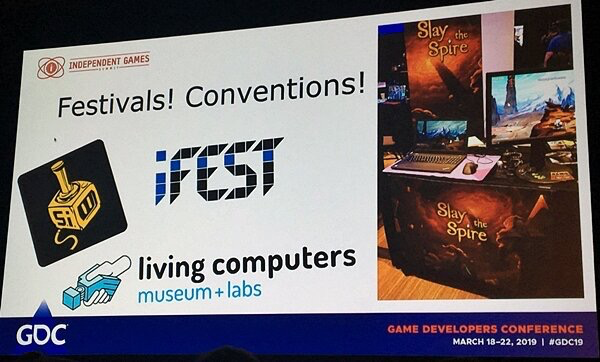
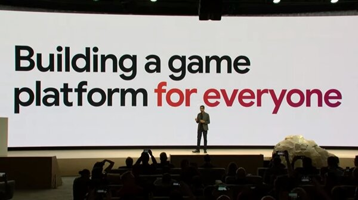
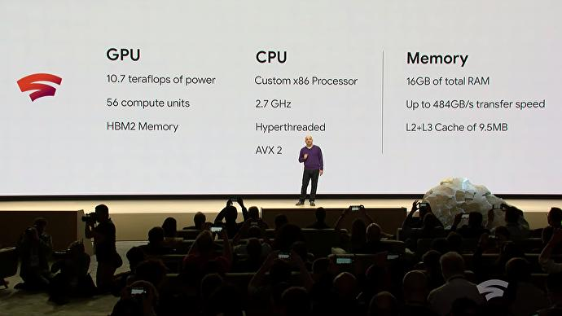
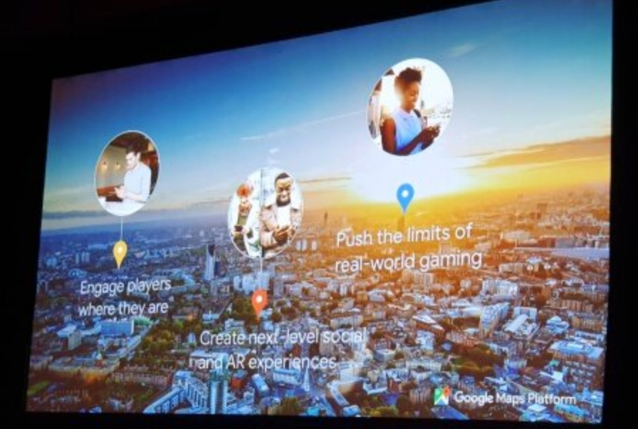
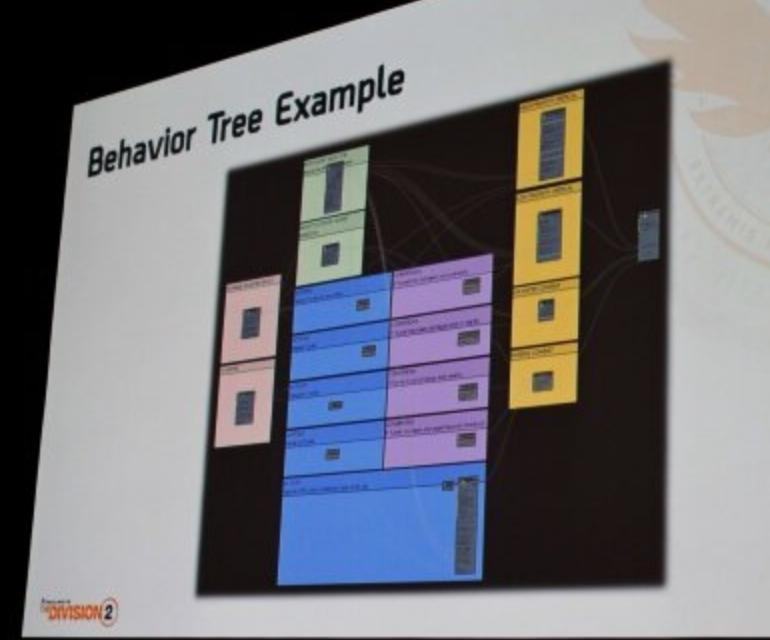
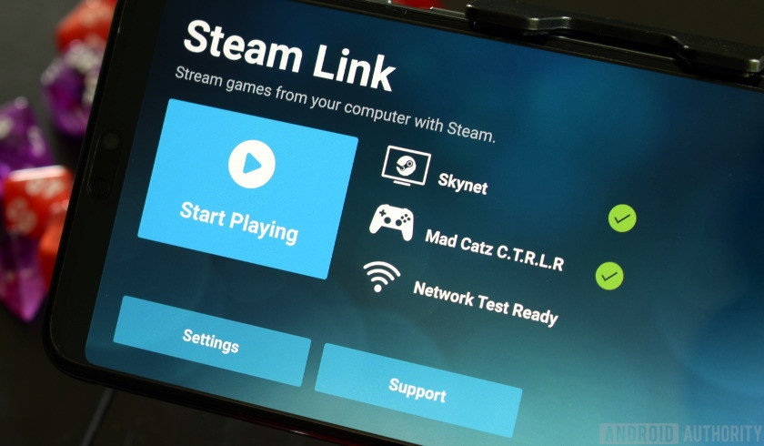

## 'SLAY THE SPIRE': METRICS DRIVEN DESIGN AND BALANCE
- 스팀 사용자 평가 99% 이상의 호평받은 인디 게임.
- 효과적인 게임 마케팅 방법과 과정에 대한 공유.

1. 인터넷을 통한 새로운 채널의 파급력이 게임 마케팅에 있어서 중요한 변화를 가져올 수 있다는 점에 주목.
    - 소셜 네트워크 및 메일링 리스트를 통한 게임 홍보.
    - 개발 블로그를 통한 관심사 유도.
    - Key-mailer([https://www.keymailer.co](https://www.keymailer.co))에 게임을 업로드하여 Streamer, YouTube Creator들을 자연스럽게 마케팅에 참여시킴.
2. 게임 페스티벌 현장에 지속적으로 참가하고 즉각적인 피드백 취합.
3. 패치, 업데이트 내용은 스토어나 소셜 네트워크를 통해 주기적으로 공지.
4. 유저의 피드백을 즉각적으로 확인할 수 있도록 자체 bot 개발.
5. 각국의 언어로 로컬라이징을 진행하는 것도 자연스러운 마케팅 수단.

지금 세상은 -**개발자들이 직접 게임을 알릴 가능성**-이 열려있는 시대. 소셜 미디어의 등장과 개발자 스스로 게임을 홍보하는 채널이 생겼다는 것, 이 모든 것이 새로운 시장성이며 기회가 될 수 있다는 점이 작은 규모의 게임에 기회가 될 수 있음.

## 'GOOGLE GAMING PLATFORM': GOOGLE PROJECT STREAM

- 신규 클라우드 콘솔 기기 **STADIA** 공개.
- '언제 어디서나 어떤 기기에서든' 게임을 즐길 수 있는 클라우드 기반의 게임 스트리밍 서비스.

- STADIA 서버의 GPU는 AMD와의 협력에서 탄생한 커스텀 칩셋을 사용.
    - 10.7 테라 플롭스의 처리 능력을 갖췄으며, 이는 Xbox One X의 1.5배, PS4 프로와는 2배 이상 차이가 나는 성능.
- QUIC + improved WebRTC 기반의 초 저-지연 스트리밍 제공.
    - 1080p@60hz 기준 200ms 미만의 레이턴시 목표.
- 게이머와 시청자, 크리에이터, 그리고 개발자를 하나로 묶기 위한 시도의 일환으로 전용 컨트롤러 생산 예정.
    - '공유' 버튼을 통해 내 플레이를 유튜브로 라이브 스트리밍하거나, '도움' 버튼을 통한 개인화 서비스 수신 등...
    - 유튜브 플랫폼과의 긴밀한 통합.
- 서비스 시점에는 '**4K@60fps, HDR, Surround Sound**' 지원 예정.
- 기술 기반 플랫폼과 스토어 운영 노하우를 가지고 있으나, 게임 퍼블리싱 관점에서 비지니스 모델을 어떻게 확대해 나갈 것인가가 관건.

## 'GOOGLE MAPS': REAL WORLD GAMING
구글의 3D 맵 정보를 이용하여 어떤 게임에서든지 현실 세계 구현이 가능.
- Unity SDK에서 구글 맵 연동 기능 제공.

- 게임 환경 특색에 따라 맵 데이터에 다양한 효과 부여 및 변형/가공 가능.
- 맛집이나 랜드마크 등과 같은 정보를 바탕으로 게임 안에서 현실 세계 반영과 부가 가치를 부여.
- 구글 맵 정보를 활용한 '워킹 데드 아워 월드', '쥬라기 월드' 등 현실 공간을 배경으로 한 오픈 월드 게임들이 속속들이 출시.

## AUTOMATED TESTING: USING AI CONTROLLED PLAYERS TO TEST 'THE DIVISION'
- NPC의 현실적인 움직임과 행동 패턴이 게임을 플레이하는 데 있어서 재미 요소에 큰 영향을 미침.
- 전작을 교훈삼아 'Division 2'에서 새롭게 진화된 NPC들의 전투 AI와 시퀀스 구축 방식을 공유.
    1. **Faction**: Fact + fiction. (*i.e., 허구와 사실의 적절한 조화*)
    2. 행동 패턴(*e.g., 공격적, 수비적, 이동...*) 별 팩션을 구축하고 상황/환경 별 이후 행동 시퀀스 분류.
        
    3. Contextualizing(맥락화) -> Modeling
    4. 반복적이고 지속적인 테스트를 통해 좀 더 정교한 팩션 모델 구축 필요.

## NVIDIA RTX: REAL-TIME RAY TRACING
- What is the Ray Tracing?
    - 1980년 'Turner Whitted'가 'An improved illumination model for shaded display' 논문에서 발표한 기법으로 이미지의 픽셀 하나하나를 통과하는 광선들이 있다고 가정하고 그 광선(Ray)을 역추적(Trace)하는 방식.
    - See [Quake II RTX Demo](https://www.youtube.com/watch?v=vY0W3MkZFs4)
- 'Unreal Engine(언리얼 엔진)' 및 'Unity(유니티)'에 실시간 레이 트레이싱 지원 통합.
- 대표적인 그래픽스 도구 집합에 공식적으로 레이 트레이싱 지원 추가.
    - **Microsoft DirectX™ Ray Tracing, DXR**.
    - Vulkan 확장 버전인 **NVIDIA VKRay**.
- 게임 개발자들이 레이 트레이싱을 게임에 추가할 수 있도록 지원하는 포괄적 도구와 렌더링 기술 세트인 '엔비디아 게임웍스 RTX(NVIDIA GameWorks RTX™)'는 다음과 같은 구성을 포함한다.
    - **RTX Denoiser SDK**: 필요한 광선 수와 픽셀당 샘플 수를 줄일 수 있는 디노이징(denoising) 기술을 제공해 빠른 실시간 레이 트레이싱을 구현하는 라이브러리. 'Ray traced area light shadows', 'Glossy reflections', 'Ambient occlusion', 'Diffuse global illumination' 등에 적용.
    - **Nsight for RT**: DXR과 그 외 지원 API로 구축된 그래픽 애플리케이션의 디버그과 프로파일을 지원해 개발자들의 시간을 절약하는 독립형 개발자 도구.
- 전용 레이 트레이싱 코어를 내장하지 않은 파스칼 기반(GeForce GTX Series) GPU에서 쉐이더 코어를 이용하여 레이 트레이싱 효과 지원.
    - GeForce RTX GPU 시리즈는 GTX 시리즈에 비해 최대 3배 빠른 레이 트레이싱 처리 속도를 보장.

## VALVE: STEAM LINK ANYWHERE

- 별도의 중계 인프라를 구축하여 동일 네트워크가 아닌, 어디서든 원격 게이밍 가능.
- 본격적인 클라우드 게이밍 서비스 구축.

## Conclusion
GDC 2019의 최대 관심사는 단연 -**클라우드 게임 스트리밍**-의 급부상이며, 더 이상 게임은 개인 자산이 아닌 컨텐츠 소비의 일부로 취급되어지는 시기가 도래했다. 이에 발맞추어 기술적인 난제를 극복하고 사내 게임의 클라우드화를 통해 얻을 수 있는 이점이 무엇인지, 그리고 구글이나 nVidia, 마이크로소프트가 추구하는 클라우드 게이밍의 목적과 